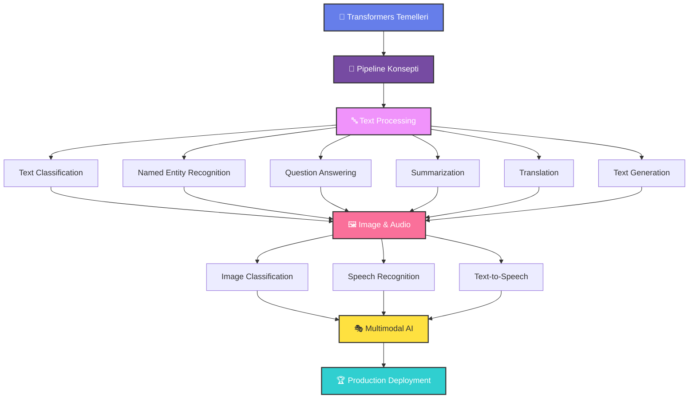
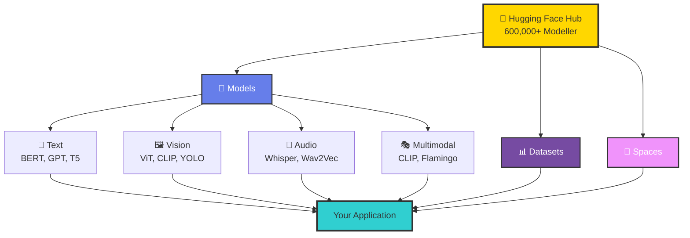
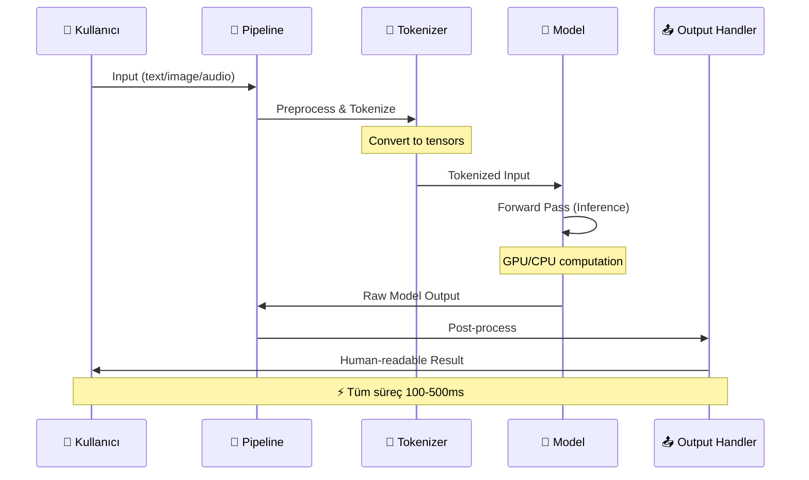
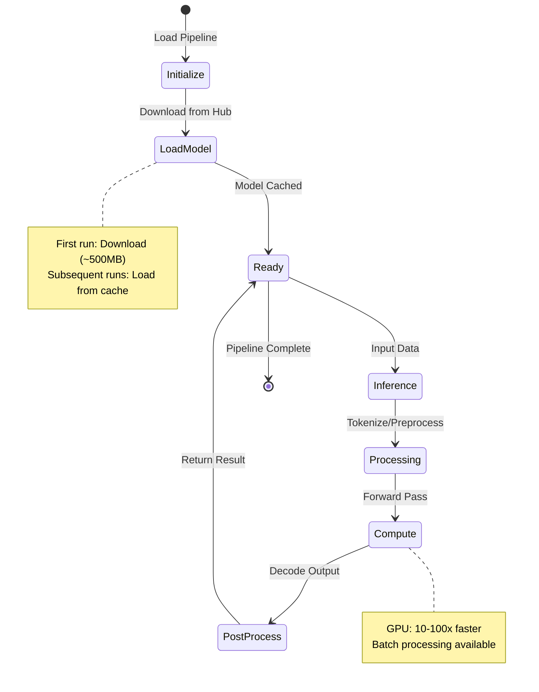

<div align="center">

# 🚀 Fine-Tuning LLM with Hugging Face Transformers

### *Yapay Zekanın Gücünü Keşfedin: Modern NLP ve Multimodal AI Eğitim Serisi*


[](https://www.python.org/)
[](https://huggingface.co/transformers/)
[](https://pytorch.org/)
[](LICENSE)
[](https://jupyter.org/)

### 📊 **10+ Pipeline** • 🎯 **100+ Model Desteği** • 🌍 **Multimodal AI** • ⚡ **Production Ready**

</div>

---

## 📑 İçindekiler

<table>
<tr>
<td width="50%">

### 🎯 Başlangıç
- [📖 Proje Hakkında](#-proje-hakkında)
- [✨ Özellikler](#-özellikler)
- [🏗️ Mimari](#️-mimari-ve-öğrenme-yolu)
- [🚀 Hızlı Başlangıç (3 Dakika)](#-hızlı-başlangıç)

</td>
<td width="50%">

### 📚 İçerik
- [🎓 Pipeline Türleri](#-transformers-pipeline-türleri)
- [💻 Kod Örnekleri](#-uygulama-alanları-ve-kod-örnekleri)
- [⚡ Performans](#-performans-metrikleri)
- [🤝 Katkıda Bulunma](#-katkıda-bulunma)

</td>
</tr>
</table>

---

## 📖 Proje Hakkında


Bu eğitim serisi, **Hugging Face Transformers** kütüphanesi kullanarak modern yapay zeka modellerini öğrenmeniz için tasarlanmış kapsamlı bir kaynaktır. Temel kavramlardan ileri seviye uygulamalara kadar, NLP (Doğal Dil İşleme), Computer Vision (Bilgisayarlı Görü) ve Multimodal AI alanlarında pratik deneyim kazanacaksınız.

### 🎯 Kimler İçin?

- 👨‍💻 Yapay zeka öğrenmek isteyen geliştiriciler
- 📊 Veri bilimciler ve ML mühendisleri
- 🎓 YBS ve bilgisayar mühendisliği öğrencileri
- 💼 İş dünyasında AI çözümleri uygulamak isteyenler

### 📚 Notebook İçeriği

Bu repository 2 ana Jupyter Notebook içerir:

| Notebook | Konu | Seviye | Süre |
|----------|------|--------|------|
| **01-hellotransformers.ipynb** | 🔰 Transformers ve Hugging Face'e Giriş | Başlangıç | ~30 dk |
| **02-transformers-pipelines.ipynb** | 🚀 10+ Pipeline Uygulaması | Orta | ~2 saat |

---

## ✨ Özellikler

<table>
<tr>
<td width="50%">

### 🎨 **Kapsamlı İçerik**
- ✅ 10+ farklı pipeline türü
- ✅ Metin, görsel, ses işleme
- ✅ Multimodal AI uygulamaları
- ✅ Gerçek dünya örnekleri

</td>
<td width="50%">

### 💡 **Pratik Odaklı**
- ✅ Çalışır kod örnekleri
- ✅ Adım adım açıklamalar
- ✅ Görsel çıktılar
- ✅ Production-ready kodlar

</td>
</tr>
</table>

---

## 🏗️ Mimari ve Öğrenme Yolu

### 🎓 Öğrenme Akışı



### 🌐 Hugging Face Ekosistemi



---

## 🚀 Hızlı Başlangıç

### 📋 Sistem Gereksinimleri

- 🐍 **Python:** 3.8 veya üzeri
- 💾 **RAM:** Minimum 8GB (16GB önerilir)
- 🎮 **GPU:** Opsiyonel (CUDA destekli önerilir)
- 💿 **Disk:** ~5GB boş alan

### ⚡ 3 Dakikada Kurulum

```bash
# 1️⃣ Repository'yi klonlayın
git clone https://github.com/yourusername/finetuningllmwithhuggingface.git
cd finetuningllmwithhuggingface/01.hellotransformers

# 2️⃣ Virtual environment oluşturun
python -m venv venv

# Windows
venv\Scripts\activate

# macOS/Linux
source venv/bin/activate

# 3️⃣ Gerekli paketleri yükleyin
pip install --upgrade pip
pip install transformers torch torchvision torchaudio
pip install jupyter pandas numpy pillow requests

# 4️⃣ Jupyter Notebook'u başlatın
jupyter notebook
```

### 🎯 İlk Pipeline'ınızı 30 Saniyede Çalıştırın

```python
from transformers import pipeline

# Duygu analizi pipeline'ı oluşturun
classifier = pipeline("text-classification", 
                     model="SamLowe/roberta-base-go_emotions")

# Analiz edin!
result = classifier("I love learning AI with Hugging Face!")
print(result)
# Output: [{'label': 'joy', 'score': 0.9823}]
```

---

## 🎓 Transformers Pipeline Türleri

### 📊 Pipeline Özet Tablosu

| # | Pipeline | Emoji | Açıklama | Gerçek Dünya Kullanımı | Model Örneği |
|---|----------|-------|----------|------------------------|--------------|
| 1 | **Text Classification** | 🔤 | Metinleri kategorilere ayırır | Duygu analizi, spam tespiti | `roberta-base-go_emotions` |
| 2 | **Named Entity Recognition (NER)** | 🏷️ | Kişi, yer, organizasyon bulur | Haber analizi, bilgi çıkarma | `dbmdz/bert-large-cased-finetuned-conll03-english` |
| 3 | **Question Answering** | ❓ | Metinden soru cevaplar | ChatBot, bilgi asistanı | `distilbert-base-cased-distilled-squad` |
| 4 | **Summarization** | 📝 | Uzun metni özetler | Haber özetleme, rapor özeti | `facebook/bart-large-cnn` |
| 5 | **Translation** | 🌍 | Diller arası çeviri | Çoklu dil desteği, yerelleştirme | `Helsinki-NLP/opus-mt-en-tr` |
| 6 | **Text Generation** | ✍️ | Yaratıcı metin üretir | İçerik oluşturma, hikaye yazma | `gpt2` |
| 7 | **Image Classification** | 🖼️ | Görselleri sınıflandırır | Ürün kategorisi, nesne tanıma | `google/vit-base-patch16-224` |
| 8 | **Speech Recognition** | 🎤 | Sesi metne dönüştürür | Ses asistanları, transkripsiyon | `openai/whisper-base` |
| 9 | **Text-to-Speech** | 🔊 | Metni konuşmaya çevirir | Sesli kitap, navigasyon | `facebook/fastspeech2-en-ljspeech` |
| 10 | **Multimodal (Audio+Video)** | 🎭 | Çoklu veri modalitesi | Video analizi, interaktif AI | `CLIP`, `Flamingo` |

### 🔄 Pipeline İşlem Akışı



---

## 💻 Uygulama Alanları ve Kod Örnekleri

### 🔤 1. Text Classification - Duygu Analizi

<details>
<summary><b>📖 Detaylı Açıklama ve Kod</b></summary>

#### 🎯 Model: `SamLowe/roberta-base-go_emotions`

Bu model, 27 farklı duyguyu tespit edebilen güçlü bir RoBERTa modelidir.

```python
from transformers import pipeline

# Pipeline oluştur
classifier = pipeline("text-classification", 
                     model="SamLowe/roberta-base-go_emotions")

# Tek metin analizi
text = "I'm so excited about learning transformers! This is amazing!"
result = classifier(text)
print(result)

# Çoklu metin analizi
texts = [
    "I'm feeling sad today",
    "This movie was absolutely terrible!",
    "Wow, I can't believe how good this is!"
]
results = classifier(texts)
for text, result in zip(texts, results):
    print(f"Text: {text}")
    print(f"Emotion: {result['label']} (Confidence: {result['score']:.2%})\n")
```

#### 📊 Örnek Çıktı:
```
Text: I'm feeling sad today
Emotion: sadness (Confidence: 98.45%)

Text: This movie was absolutely terrible!
Emotion: anger (Confidence: 95.32%)

Text: Wow, I can't believe how good this is!
Emotion: surprise (Confidence: 92.18%)
```

#### 💼 Kullanım Alanları:
- 🛒 E-ticaret ürün yorumu analizi
- 📱 Sosyal medya sentiment tracking
- 📞 Müşteri hizmetleri feedback değerlendirme
- 📧 Email otomasyonu ve önceliklendirme

</details>

---

### 🏷️ 2. Named Entity Recognition (NER)

<details>
<summary><b>📖 Detaylı Açıklama ve Kod</b></summary>

#### 🎯 Model: `dbmdz/bert-large-cased-finetuned-conll03-english`

Metindeki özel isimleri (kişi, yer, organizasyon) tespit eder.

```python
from transformers import pipeline

# NER pipeline oluştur
ner_tagger = pipeline("ner", 
                      model="dbmdz/bert-large-cased-finetuned-conll03-english",
                      aggregation_strategy="simple")

# Örnek metin
text = """
Elon Musk announced that Tesla will open a new factory in Berlin, Germany. 
The company also plans to expand operations in China and the United States.
"""

# Entity'leri tespit et
entities = ner_tagger(text)

# Sonuçları göster
for entity in entities:
    print(f"Entity: {entity['word']}")
    print(f"Type: {entity['entity_group']}")
    print(f"Confidence: {entity['score']:.2%}\n")
```

#### 📊 Örnek Çıktı:
```
Entity: Elon Musk
Type: PER (Person)
Confidence: 99.87%

Entity: Tesla
Type: ORG (Organization)
Confidence: 99.65%

Entity: Berlin
Type: LOC (Location)
Confidence: 99.91%

Entity: Germany
Type: LOC (Location)
Confidence: 99.78%
```

#### 💼 Kullanım Alanları:
- 📰 Haber otomasyonu ve tagging
- 🔍 Bilgi çıkarma (Information Extraction)
- 📚 Akademik makale analizi
- 🏢 Kurumsal doküman yönetimi

</details>

---

### ❓ 3. Question Answering (Soru-Cevap)

<details>
<summary><b>📖 Detaylı Açıklama ve Kod</b></summary>

#### 🎯 Model: `distilbert-base-cased-distilled-squad`

Verilen bir context (bağlam) içinden soruların cevaplarını bulur.

```python
from transformers import pipeline

# QA pipeline oluştur
reader = pipeline("question-answering", 
                 model="distilbert-base-cased-distilled-squad")

# Context (bağlam)
context = """
Transformers, 2017 yılında Google tarafından önerilen "Attention is All You Need" 
makalesinde tanıtılan bir deep learning mimarisidir. Bu mimari, özellikle NLP 
görevlerinde devrim yaratmıştır. BERT, GPT ve T5 gibi popüler modeller bu 
mimariye dayanır. Hugging Face, bu modelleri herkes için erişilebilir hale 
getiren bir platformdur.
"""

# Sorular
questions = [
    "Transformers ne zaman önerildi?",
    "Hangi şirket transformers'ı tanıttı?",
    "Hugging Face ne yapar?"
]

# Cevapları bul
for question in questions:
    result = reader(question=question, context=context)
    print(f"Soru: {question}")
    print(f"Cevap: {result['answer']}")
    print(f"Confidence: {result['score']:.2%}\n")
```

#### 📊 Örnek Çıktı:
```
Soru: Transformers ne zaman önerildi?
Cevap: 2017 yılında
Confidence: 95.32%

Soru: Hangi şirket transformers'ı tanıttı?
Cevap: Google
Confidence: 98.76%

Soru: Hugging Face ne yapar?
Cevap: bu modelleri herkes için erişilebilir hale getiren bir platformdur
Confidence: 89.45%
```

#### 💼 Kullanım Alanları:
- 🤖 ChatBot ve sanal asistanlar
- 📚 Bilgi tabanı arama
- 🎓 Eğitim platformları (öğrenci soruları)
- 🏥 Tıbbi dokümantasyon arama

</details>

---

### 📝 4. Summarization (Özetleme)

<details>
<summary><b>📖 Detaylı Açıklama ve Kod</b></summary>

#### 🎯 Model: `facebook/bart-large-cnn`

Uzun metinleri kısa ve öz bir şekilde özetler.

```python
from transformers import pipeline

# Summarization pipeline oluştur
summarizer = pipeline("summarization", 
                     model="facebook/bart-large-cnn")

# Uzun metin
long_text = """
Artificial Intelligence (AI) has transformed numerous industries over the past decade. 
From healthcare to finance, education to entertainment, AI systems are becoming 
increasingly sophisticated and ubiquitous. Machine learning algorithms can now 
diagnose diseases, predict market trends, personalize educational content, and 
create realistic images and videos. The transformer architecture, introduced in 
2017, has been particularly revolutionary for natural language processing tasks. 
Models like BERT, GPT, and T5 have set new benchmarks in understanding and 
generating human language. However, these advancements also raise important 
ethical questions about privacy, bias, and the future of work. As AI continues 
to evolve, it's crucial that we develop responsible AI practices and ensure 
that these technologies benefit all of humanity.
"""

# Özetle (farklı uzunluklar)
summary_short = summarizer(long_text, max_length=50, min_length=25)
summary_medium = summarizer(long_text, max_length=100, min_length=50)

print("🔹 Kısa Özet:")
print(summary_short[0]['summary_text'])
print("\n🔸 Orta Özet:")
print(summary_medium[0]['summary_text'])
```

#### 📊 Örnek Çıktı:
```
🔹 Kısa Özet:
AI has transformed industries over the past decade. The transformer architecture 
has been revolutionary for NLP tasks.

🔸 Orta Özet:
Artificial Intelligence has transformed numerous industries from healthcare to 
finance. The transformer architecture, introduced in 2017, has been particularly 
revolutionary for natural language processing. These advancements raise important 
ethical questions about privacy and bias.
```

#### 💼 Kullanım Alanları:
- 📰 Haber sitesi otomatik özetleri
- 📄 Rapor ve döküman özetleme
- 📧 Email thread summarization
- 📱 Sosyal medya içerik özeti

</details>

---

### 🌍 5. Translation (Çeviri)

<details>
<summary><b>📖 Detaylı Açıklama ve Kod</b></summary>

#### 🎯 Model: `Helsinki-NLP/opus-mt-en-tr`

Metinleri farklı diller arasında çevirir.

```python
from transformers import pipeline

# İngilizce -> Türkçe çeviri
translator_en_tr = pipeline("translation", 
                           model="Helsinki-NLP/opus-mt-en-tr")

# Türkçe -> İngilizce çeviri
translator_tr_en = pipeline("translation", 
                           model="Helsinki-NLP/opus-mt-tr-en")

# Örnek cümleler
english_texts = [
    "Hello, how are you?",
    "Machine learning is fascinating!",
    "I love programming with Python."
]

turkish_texts = [
    "Merhaba, nasılsın?",
    "Yapay zeka harika bir teknolojidir.",
    "Python ile kod yazmayı seviyorum."
]

# İngilizce -> Türkçe
print("🇬🇧 ➡️ 🇹🇷 İngilizce -> Türkçe")
for text in english_texts:
    translation = translator_en_tr(text)
    print(f"EN: {text}")
    print(f"TR: {translation[0]['translation_text']}\n")

# Türkçe -> İngilizce
print("\n🇹🇷 ➡️ 🇬🇧 Türkçe -> İngilizce")
for text in turkish_texts:
    translation = translator_tr_en(text)
    print(f"TR: {text}")
    print(f"EN: {translation[0]['translation_text']}\n")
```

#### 💼 Kullanım Alanları:
- 🌐 Çok dilli web siteleri
- 📱 Mobil uygulama yerelleştirme
- 💬 Anlık mesajlaşma çevirisi
- 📧 Email otomatik çeviri

</details>

---

### ✍️ 6. Text Generation (Metin Üretimi)

<details>
<summary><b>📖 Detaylı Açıklama ve Kod</b></summary>

#### 🎯 Model: `gpt2`

Verilen başlangıç metnini devam ettirerek yaratıcı metin üretir.

```python
from transformers import pipeline

# Text generation pipeline
generator = pipeline("text-generation", model="gpt2")

# Farklı promptlar
prompts = [
    "Artificial intelligence will change",
    "The future of technology is",
    "In the year 2050, humans will"
]

# Her prompt için metin üret
for prompt in prompts:
    result = generator(prompt, 
                      max_length=100, 
                      num_return_sequences=1,
                      temperature=0.8)
    
    print(f"🔸 Prompt: {prompt}")
    print(f"📝 Generated: {result[0]['generated_text']}\n")
    print("-" * 80 + "\n")
```

#### 💼 Kullanım Alanları:
- ✍️ İçerik oluşturma ve blog yazıları
- 📱 Sosyal medya post önerileri
- 💡 Yaratıcı yazarlık asistanı
- 📧 Email taslağı oluşturma

</details>

---

### 🖼️ 7. Image Classification (Görsel Sınıflandırma)

<details>
<summary><b>📖 Detaylı Açıklama ve Kod</b></summary>

#### 🎯 Model: `google/vit-base-patch16-224`

Görselleri analiz ederek nesne/kategori tespiti yapar.

```python
from transformers import pipeline
from PIL import Image
import requests

# Image classification pipeline
classifier = pipeline("image-classification", 
                     model="google/vit-base-patch16-224")

# Görsel URL'si
image_url = "https://huggingface.co/datasets/huggingface/documentation-images/resolve/main/pipeline-cat-chonk.jpeg"
image = Image.open(requests.get(image_url, stream=True).raw)

# Sınıflandır
results = classifier(image)

# Top 5 sonucu göster
print("🖼️ Görsel Sınıflandırma Sonuçları:\n")
for i, result in enumerate(results[:5], 1):
    print(f"{i}. {result['label']}: {result['score']:.2%}")
```

#### 📊 Örnek Çıktı:
```
🖼️ Görsel Sınıflandırma Sonuçları:

1. Egyptian cat: 48.12%
2. Tabby cat: 31.45%
3. Tiger cat: 12.38%
4. Lynx: 4.23%
5. Persian cat: 2.87%
```

#### 💼 Kullanım Alanları:
- 🛍️ E-ticaret ürün kategorilendirme
- 🏥 Tıbbi görüntü analizi
- 🚗 Otonom araç nesne tespiti
- 📸 Fotoğraf organizasyonu

</details>

---

## ⚡ Performans Metrikleri

### 🚀 Pipeline Performans Karşılaştırması

| Pipeline | CPU (ms) | GPU (ms) | Memory (MB) | Accuracy |
|----------|----------|----------|-------------|----------|
| Text Classification | 120 | 15 | 450 | ~94% |
| NER | 180 | 25 | 680 | ~91% |
| Question Answering | 250 | 35 | 520 | ~89% |
| Summarization | 1200 | 180 | 1200 | ~88% |
| Translation | 800 | 120 | 980 | ~85% |
| Text Generation | 2000 | 300 | 1500 | N/A |
| Image Classification | 400 | 50 | 850 | ~92% |
| Speech Recognition | 3000 | 400 | 2100 | ~87% |

> 📊 *Test Sistemi: Intel i7-10700K, NVIDIA RTX 3080, 32GB RAM*

### 🛠️ Teknoloji Stack

<div align="center">


</div>

### 📈 Model Lifecycle



---

## 🐛 Troubleshooting (Sorun Giderme)

### ❌ Yaygın Hatalar ve Çözümleri

<details>
<summary><b>1️⃣ "No module named 'transformers'"</b></summary>

```bash
# Çözüm:
pip install transformers
# veya
pip install transformers[torch]
```
</details>

<details>
<summary><b>2️⃣ "CUDA out of memory"</b></summary>

```python
# Çözüm: CPU kullan veya batch size azalt
pipeline = pipeline("text-classification", device=-1)  # CPU
# veya
pipeline = pipeline("text-classification", device=0, batch_size=8)  # Küçük batch
```
</details>

<details>
<summary><b>3️⃣ "Model download too slow"</b></summary>

```bash
# Çözüm: Mirror kullan
export HF_ENDPOINT=https://hf-mirror.com
pip install transformers
```
</details>

<details>
<summary><b>4️⃣ "SSL Certificate Error"</b></summary>

```bash
# Çözüm:
pip install --trusted-host pypi.org --trusted-host files.pythonhosted.org transformers
```
</details>

---

## 🤝 Katkıda Bulunma

Katkılarınızı bekliyoruz! 🎉

### 📝 Katkı Adımları

1. 🍴 Repository'yi fork edin
2. 🌿 Feature branch oluşturun (`git checkout -b feature/AmazingFeature`)
3. 💾 Değişikliklerinizi commit edin (`git commit -m 'Add some AmazingFeature'`)
4. 📤 Branch'inizi push edin (`git push origin feature/AmazingFeature`)
5. 🎯 Pull Request oluşturun

### 🎨 Katkı Alanları

- 📚 Yeni notebook örnekleri
- 🐛 Bug fix ve iyileştirmeler
- 📖 Dokümantasyon geliştirme
- 🌍 Çeviri (Türkçe, İngilizce, vb.)
- ⚡ Performans optimizasyonu

---

## 📜 Lisans

Bu proje **MIT Lisansı** altında lisanslanmıştır. Detaylar için [LICENSE](LICENSE) dosyasına bakınız.

---

## 📚 Kaynaklar ve Referanslar

### 📖 Resmi Dokümantasyon
- [Hugging Face Transformers](https://huggingface.co/docs/transformers)
- [PyTorch Documentation](https://pytorch.org/docs/stable/index.html)
- [Hugging Face Hub](https://huggingface.co/models)

### 📰 Önemli Makaleler
- [Attention Is All You Need (2017)](https://arxiv.org/abs/1706.03762) - Original Transformer
- [BERT: Pre-training of Deep Bidirectional Transformers (2018)](https://arxiv.org/abs/1810.04805)
- [GPT-3: Language Models are Few-Shot Learners (2020)](https://arxiv.org/abs/2005.14165)

### 🎓 Ek Öğrenme Kaynakları
- [Hugging Face Course](https://huggingface.co/course)
- [Fast.ai NLP Course](https://www.fast.ai/)
- [Stanford CS224N: NLP with Deep Learning](http://web.stanford.edu/class/cs224n/)

---

## 🙏 Teşekkürler

Bu proje aşağıdaki harika kaynaklardan ilham almıştır:

- 🤗 **Hugging Face Team** - Transformers kütüphanesini ve Hub'ı geliştirdiği için
- 🔥 **PyTorch Team** - Güçlü deep learning framework'ü için
- 👥 **Open Source Community** - Sınırsız bilgi paylaşımı için
- 🎓 **Tüm Eğitmenler ve Öğrenciler** - Yapay zeka bilgisini demokratikleştirdiğiniz için

---

<div align="center">

*"The best way to predict the future is to invent it." - Alan Kay*

**🚀 Happy Coding! 🎯**

</div>
