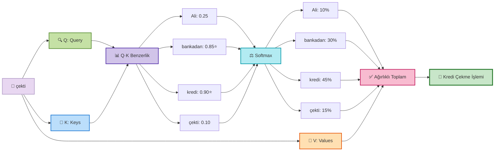
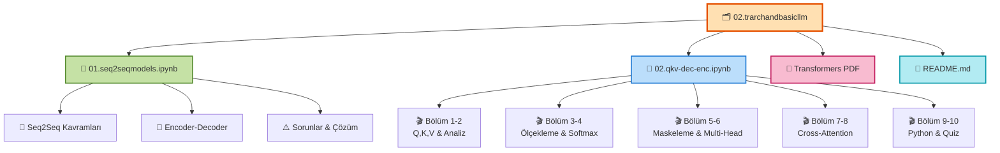

```
╔════════════════════════════════════════════════════════════════════════════════╗
║                                                                                ║
║        ███████╗██╗     ███████╗ ██████╗  ██████╗ ██████╗ ███████╗███████╗   ║
║        ╚════██║██║     ██╔════╝██╔═══██╗██╔═══██╗██╔══██╗██╔════╝██╔════╝   ║
║          ███╔═╝██║     █████╗  ██║   ██║██║   ██║██║  ██║███████╗███████╗   ║
║         ██╔══╝ ██║     ██╔══╝  ██║   ██║██║   ██║██║  ██║╚════██║╚════██║   ║
║        ███████╗███████╗███████╗╚██████╔╝╚██████╔╝██████╔╝███████║███████║   ║
║        ╚══════╝╚══════╝╚══════╝ ╚═════╝  ╚═════╝ ╚═════╝ ╚══════╝╚══════╝   ║
║                                                                                ║
║                 🧠 Transformer Architecture & Attention Mechanism             ║
║                  🎓 Modern AI Models'un Kalbinde Yatan Sırlar                ║
║                                                                                ║
╚════════════════════════════════════════════════════════════════════════════════╝
```

# 🚀 Transformer Mimarisi ve Dikkat Mekanizması - Eğitim Modülleri

[](https://www.python.org/)
[](https://jupyter.org/)
[](LICENSE)
[]()

---

## 📖 İçerik Haritası

- [Proje Hakkında](#proje-hakkında)
- [Dosya Yapısı](#dosya-yapısı)
- [Eğitim Modülleri](#eğitim-modülleri)
- [Öğrenme Çıktıları](#öğrenme-çıktıları)
- [Teknoloji Stack](#teknoloji-stack)
- [Kurulum ve Başlangıç](#kurulum-ve-başlangıç)
- [Derin İçelik Özeti](#derin-içelik-özeti)
- [Kaynaklar ve Referanslar](#kaynaklar-ve-referanslar)

---

### 🎯 Hızlı Özet - Transformer Mimarisi

```mermaid
flowchart LR
    INPUT["📝 INPUT<br/>Ali bankadan<br/>kredi çekti"] --> EMB["🔄 Embedding<br/>Positional<br/>Encoding"]
    
    EMB --> ENC["🔵 ENCODER"]
    ENC --> ENCA["🔗 Self-Attention<br/>↓<br/>🧠 Feed-Forward<br/>↓<br/>↻ N katman"]
    ENCA --> CTX["📊 Context<br/>Vectors"]
    
    CTX --> DEC["🟢 DECODER"]
    DEC --> DECA["🔗 Self-Attention<br/>↓<br/>🔄 Cross-Attention<br/>↓<br/>↻ N katman"]
    DECA --> OUT["✅ OUTPUT<br/>Çay zamanı<br/>geldi"]
    
    CTX -.-> DECA
    
    style INPUT fill:#E8D7F1,stroke:#B59FCA,stroke-width:3px,color:#333
    style EMB fill:#D4EDDA,stroke:#7CB342,stroke-width:2px,color:#333
    style ENC fill:#BBDEFB,stroke:#1976D2,stroke-width:3px,color:#333
    style ENCA fill:#C5E1A5,stroke:#558B2F,stroke-width:2px,color:#333
    style CTX fill:#B2EBF2,stroke:#0097A7,stroke-width:3px,color:#333
    style DEC fill:#C8E6C9,stroke:#388E3C,stroke-width:3px,color:#333
    style DECA fill:#F0F4C3,stroke:#9E9D24,stroke-width:2px,color:#333
    style OUT fill:#C8E6C9,stroke:#2E7D32,stroke-width:3px,color:#333
```



---

### 🧠 Dikkat Mekanizması - Temel Akış



---

## 📚 Proje Hakkında

Bu proje, **Hugging Face Transformers** ile Fine-Tuning öğreniminin ikinci modülüdür. Modern yapay zeka modellerinin (ChatGPT, BERT, GPT-4 vb.) temelinde yatan **Transformer mimarisi** ve özellikle **Dikkat Mekanizması (Attention Mechanism)** konularını **derinlemesine ve uygulamalı** olarak öğretmeyi amaçlar.

### 🎯 Amaç

- ✅ Seq2Seq (Sequence-to-Sequence) modellerini anlamak
- ✅ Encoder-Decoder mimarisinin nasıl çalıştığını öğrenmek
- ✅ Dikkat mekanizmasının temel kavramlarını (Q, K, V) açıklamak
- ✅ Transformer yapısının matematiksel temelini kurmak
- ✅ Pratik Python uygulamalarıyla bilgiyi pekiştirmek

### 🌟 Hedef Kitle

- 🎓 Bilgisayar Mühendisliği öğrencileri
- 🔬 YBS öğrencileri
- 💼 Makine Öğrenmesi meraklıları
- 🚀 NLP (Doğal Dil İşleme) pratisyenleri

---

## 📁 Dosya Yapısı



---

## 🎓 Eğitim Modülleri

### 📓 1. Seq2Seq Modelleri ve Attention Mekanizması
**Dosya:** `01.seq2seqmodels.ipynb` (1800 satır)

#### 📌 İçeriği:
- **Seq2Seq Nedir?** - Giriş ve temel fikir
  - Makine çevirisi, metin özetleme, soru cevaplama örnekleri
  - Günlük hayattan benzetmeler (dinle → anla → anlat)
  
- **Encoder-Decoder Mimarisi** - Detaylı açıklama
  - 🔵 ENCODER (Kodlayıcı): Kelimeleri sırayla işler, gizli durumlar oluşturur
  - 🟢 DECODER (Kod Çözücü): Özet vektörden yola çıkarak yeni cümle üretir
  - Otoregresif üretim (Autoregressive Generation)
  
- **Büyük Sorunlar: Neden Yeterli Değil?**
  - ⚠️ Bilgi Darboğazı (Information Bottleneck)
  - ⚠️ Sıralı İşlem (Sequential Processing)
  - 📊 Performans grafiği: Cümle uzunluğu vs başarı ilişkisi
  
- **Çözüm Fikri: Dikkat Mekanizması**
  - Tüm gizli durumları saklama
  - Gerektiğinde dönüp bakmak (Attention)

#### 🎯 Öğrenme Hedefleri:
- [ ] Seq2Seq modellerin temel çalışma prensibini anlama
- [ ] Encoder ve Decoder'ın rollerini ayırt edebilme
- [ ] Klasik Seq2Seq'nin sınırlamalarını fark etme
- [ ] Dikkat mekanizmasının neden gerekli olduğunu açıklayabilme

---

### 🎯 2. Dikkat Mekanizması: Q, K, V ve Transformatör Mimarisi
**Dosya:** `02.qkv-dec-enc.ipynb` (5265 satır)

#### 📌 Bölümler:

**🎬 BÖLÜM 1: YouTube Analojisi ile Q, K, V Kavramları**
- YouTube arama sistemi paralelliği
- 🔍 Query (Q): Aradığınız terim
- 🔑 Key (K): Video başlıkları, etiketleri
- 💎 Value (V): Videonun gerçek içeriği
- Benzerlik puanları ve ağırlıklandırma

**🎬 BÖLÜM 2: Cümle Analizi - Dikkat Pratikte**
- Gerçek cümle örneği: "Ali bankadan kredi çekti"
- "çekti" kelimesinin belirsizliği
- Bağlamsal anlam nasıl çıkarılır?
- Dikkat matrisinin görselleştirilmesi

**🎬 BÖLÜM 3: Ölçekli Nokta Çarpım (Scaled Dot-Product)**
- Nokta çarpım: Q · K
- Neden √d_k ile bölüyoruz?
- Ölçeklemenin matematiksel nedenleri
- Büyük boyutlarda stabilite

**🎬 BÖLÜM 4: Softmax - Ağırlık Dağılımı**
- Softmax fonksiyonu nedir?
- Formül: σ(x_i) = exp(x_i) / Σ exp(x_j)
- Sıcaklık (Temperature) parametresi
- Olasılık dağılımına dönüşüm

**🎬 BÖLÜM 5: Maskeleme - Geleceği Görmeme Kuralı**
- Decoder maskeleme neden gerekli?
- Otoregresif üretimde bilgi sızıntısını önlemek
- Causal maskeleme uygulaması

**🎬 BÖLÜM 6: Çok Kafalı Dikkat (Multi-Head Attention)**
- Neden sadece tek dikkat yetmez?
- Paralel dikkat başları
- Her başın farklı perspektifi
- Sonuçların birleştirilmesi

**🎬 BÖLÜM 7: Encoder-Decoder Mimarisi**
- Transformer çevirmen mimarisi
- Cross-Attention mekanizması
- Encoder çıktısını Decoder'a geçmek

**🎬 BÖLÜM 8: Konumsal Kodlama (Positional Encoding)**
- Kelimelerin sırasının önemi
- Sinüs/kosinüs tabanlı konumsal vektörler
- Transformer'a sıra bilgisini ekleme

**🎬 BÖLÜM 9: Python Uygulaması**
- Numpy ile attention mekanizması kodlaması
- Adım adım hesaplama
- Görselleştirme ve analiz
- Basit bir dikkat katmanı yazma

**🎬 BÖLÜM 10: Özet ve Quiz**
- Tüm kavramların pekiştirilmesi
- Kendini test etme soruları
- Sınırlamalar ve ileri konular

#### 🎯 Öğrenme Hedefleri:
- [ ] Q, K, V kavramlarını YouTube örneği ile anlama
- [ ] Ölçekli nokta çarpımı hesaplayabilme
- [ ] Softmax ve maskelemeyi açıklayabilme
- [ ] Dikkat matrislerini yorumlayabilme
- [ ] Çok kafalı dikkat mimarisini anlaşabilme
- [ ] Python'da attention mekanizması kodlayabilme

---

## 🎯 Öğrenme Çıktıları

Bu modülleri tamamladığınızda aşağıdakileri yapabilir olacaksınız:

### 🔧 Teknik Beceriler
- ✅ Transformer mimarisinin temel yapısını anlama
- ✅ Dikkat mekanizmasının her adımını matematiksel olarak hesaplama
- ✅ Farklı dikkat stratejilerini (self-attention, cross-attention) tanıma
- ✅ NumPy ile dikkat katmanları yazma

### 🧠 Kavramsal Anlayış
- ✅ Neden Seq2Seq modelleri yetersiz olduğunu açıklama
- ✅ Dikkat mekanizmasının "bilgi bottleneck" sorununu çözmeyi anlama
- ✅ Q, K, V'nin rolünü bağlamsal olarak açıklama
- ✅ Ölçekleme ve softmax'in neden gerekli olduğunu anlama

### 📊 Pratik Uygulamalar
- ✅ Dikkat ağırlıklarını görselleştirme
- ✅ Dikkat matrislerini analiz etme
- ✅ Farklı cümlelerde modeli test etme
- ✅ Hata ayıklama ve model davranışını anlama

---

## ⚙️ Teknoloji Stack

### � Technology Stack - Visual Overview

```
┌────────────────────────────────────────────────────────────────┐
│                    TECHNOLOGY ECOSYSTEM                        │
└────────────────────────────────────────────────────────────────┘

    ╔═══════════════════════════════════════════════════════════╗
    ║                   CORE ENVIRONMENT                        ║
    ╠═══════════════════════════════════════════════════════════╣
    ║  🐍 Python 3.8+   ← Temel programlama dili              ║
    ║  📓 Jupyter      ← İnteraktif notebook ortamı           ║
    ╚═══════════════════════════════════════════════════════════╝

    ╔═══════════════════════════════════════════════════════════╗
    ║              SCIENTIFIC COMPUTING LAYER                   ║
    ╠═══════════════════════════════════════════════════════════╣
    ║  NumPy        → Sayısal hesaplamalar                     ║
    ║  Matplotlib   → Grafikler ve diagramlar                 ║
    ║  Seaborn      → İleri görselleştirme                    ║
    ║  SciPy        → İstatistik ve optimizasyon              ║
    ╚═══════════════════════════════════════════════════════════╝

    ╔═══════════════════════════════════════════════════════════╗
    ║           DEEP LEARNING FRAMEWORKS (İsteğe bağlı)         ║
    ╠═══════════════════════════════════════════════════════════╣
    ║  PyTorch            → Tensor işlemleri                   ║
    ║  Hugging Face 🤗   → Transformers kütüphanesi          ║
    ║  TensorFlow         → Alternatif framework              ║
    ╚═══════════════════════════════════════════════════════════╝

    ╔═══════════════════════════════════════════════════════════╗
    ║                OUTPUT & DEPLOYMENT                        ║
    ╠═══════════════════════════════════════════════════════════╣
    ║  IPython/Jupyter  → Etkileşimli çalışma                 ║
    ║  Git              → Versiyon kontrolü                    ║
    ║  VS Code          → Kod editörü                          ║
    ╚═══════════════════════════════════════════════════════════╝
```

###�📚 Kütüphaneler
- **NumPy** - Sayısal hesaplama
- **Matplotlib** - Görselleştirme
- **Seaborn** - Gelişmiş görselleştirme (ısı haritaları)
- **IPython** - Jupyter interaktifliği
- **Transformers (Hugging Face)** - Gerçek model uygulamaları

### 💻 Sistem Gereksinimleri
- **Python:** 3.8+
- **RAM:** 4GB minimum (8GB önerilir)
- **GPU:** İsteğe bağlı (CPU ile çalışır)
- **OS:** Windows, Mac, Linux

---

## 🚀 Kurulum ve Başlangıç

### 1️⃣ Gerekli Paketleri Yükleyin

```bash
# Temel bilimsel kütüphaneler
pip install numpy matplotlib seaborn

# Jupyter Notebook
pip install jupyter

# (İsteğe bağlı) Hugging Face Transformers
pip install transformers torch
```

### 2️⃣ Notebook'u Açın

```bash
# Proje klasörüne gidin
cd path/to/02.trarchandbasicllm

# Jupyter'i başlatın
jupyter notebook

# Tarayıcıda şu dosyaları açın:
# - 01.seq2seqmodels.ipynb
# - 02.qkv-dec-enc.ipynb
```

### 3️⃣ Nasıl Bir Sıra İzlemeliyim?

```mermaid
graph LR
    S(["🚀 Başla"]) --> S1["📓 Seq2Seq<br/>Notebook"]
    S1 --> S2["🧠 Kavramları<br/>Pekiştir"]
    S2 --> S3["🎯 Dikkat<br/>Notebook"]
    S3 --> S4["🎥 YouTube<br/>Analojisi"]
    S4 --> S5["📐 Matematik<br/>Hesaplamalar"]
    S5 --> S6["💻 Python<br/>Kodları"]
    S6 --> S7["📝 Quiz<br/>Testi"]
    S7 --> E(["🎉 Başarılı!"])
    
    style S fill:#C8E6C9,stroke:#2E7D32,stroke-width:3px
    style S1 fill:#C5E1A5,stroke:#558B2F,stroke-width:2px
    style S2 fill:#BBDEFB,stroke:#1976D2,stroke-width:2px
    style S3 fill:#FFE0B2,stroke:#E65100,stroke-width:2px
    style S4 fill:#F8BBD0,stroke:#C2185B,stroke-width:2px
    style S5 fill:#B2EBF2,stroke:#0097A7,stroke-width:2px
    style S6 fill:#D1C4E9,stroke:#512DA8,stroke-width:2px
    style S7 fill:#E0BBE4,stroke:#7B1FA2,stroke-width:2px
    style E fill:#C8E6C9,stroke:#2E7D32,stroke-width:3px
```



---

## 🔍 Derin İçerik Özeti

### 📖 Temel Kavramlar Glossarı

| Kavram | Açıklama | Örnek |
|--------|----------|-------|
| **Sequence** | Sıralı veri (kelime dizileri) | "Bugün hava güzel" |
| **Embedding** | Kelimeyi sayısal vektöre çevirme | [0.5, -0.3, 0.8, ...] |
| **Hidden State** | Encoder'ın ara hesaplamalarında oluşan vektör | h₁, h₂, h₃ |
| **Context Vector** | Encoder'ın son çıktısı (özet) | Tek bir vektör |
| **Query (Q)** | Anlamlandırılacak kelime | "çekti" |
| **Key (K)** | Karşılaştırma için özellikler | Tüm kelimelerin temsilleri |
| **Value (V)** | Gerçek bilgi paketleri | Kelimelerin anlamları |
| **Attention Score** | Q ve K benzerliği | 0.95, 0.15, 0.88 |
| **Softmax** | Puanları ağırlıklara çevirme | [0.45, 0.40, 0.10, 0.05] |
| **Attention Weight** | Normalize edilmiş dikkat ağırlığı | %45, %40, %10, %5 |
| **Scaled Dot-Product** | Q·K / √d_k formülü | Stabilize edilmiş puan |
| **Multi-Head** | Paralel dikkat başları | 8 veya 12 dikkat başı |

### 🧩 Temel Formüller

#### Ölçekli Nokta Çarpım Dikkat

$$\text{Attention}(Q, K, V) = \text{softmax}\left(\frac{QK^T}{\sqrt{d_k}}\right)V$$

Nedir bu formül?
- Q: Query vektörleri (anlamlandırılacak)
- K: Key vektörleri (karşılaştırmak için)
- V: Value vektörleri (çıkış bilgisi)
- d_k: Key vektörünün boyutu
- √d_k: Ölçekleme faktörü

#### Softmax

$$\text{softmax}(x_i) = \frac{e^{x_i}}{\sum_{j} e^{x_j}}$$

- Herhangi bir sayıyı 0-1 arasına çevirir
- Tüm çıktıların toplamı tam olarak 1.0'dır
- Olasılık dağılımı oluşturur

### 🎬 Kritik Noktalar

#### ⚠️ Problem #1: Bilgi Darboğazı
```
Uzun cümle (20+ kelime) 
    ↓
Tümü tek vektöre sıkıştırılır 
    ↓
Başlangıçtaki bilgiler kaybolur 
    ↓
Tercüme kalitesi düşer ❌
```

**Çözüm:** Tüm gizli durumları saklamak (Attention)

#### ⚠️ Problem #2: Sıralı İşlem
```
Klasik RNN:
    Word 1 → Word 2 → Word 3 → Word 4
    (Sequential - Bitmesi beklenir)

Transformer:
    Word 1 ─┐
    Word 2 ─┼─→ Paralel işlem
    Word 3 ─┤   (Çok daha hızlı!) ⚡
    Word 4 ─┘
```

#### ✅ Dikkat Mekanizmasının Avantajları

1. **Uzun Bağlamı Tutar**: Paralel olarak tüm kelimelere erişim
2. **Hızlı İşlem**: Paralel hesaplama mümkün
3. **Esneklik**: Farklı dikkat başları farklı bilgiler yakalar
4. **Yorumlanabilirlik**: Dikkat ağırlıkları gösterir hangi kelime önemli

### 📊 Performans Kıyaslaması

| Özellik | Seq2Seq | Transformer |
|---------|---------|-------------|
| Cümle Uzunluğu | 20 kelimenin üzerinde düşer | Uzun cümlede stabil |
| İşlem Hızı | Yavaş (sıralı) | Hızlı (paralel) |
| Bellek Kullanımı | Az | Daha fazla |
| Yorumlanabilirlik | Düşük | Yüksek (dikkat ağırlıkları) |
| Benchmarks | BLEU: ~25 | BLEU: ~30+ |

---

## 📚 Kaynaklar ve Referanslar

### 📖 Orijinal Makaleler
1. **"Attention is All You Need"** (Vaswani et al., 2017)
   - Transformer mimarisinin ilk tanıtımı
   - PDF: https://arxiv.org/abs/1706.03762

2. **"Neural Machine Translation by Jointly Learning to Align and Translate"** (Bahdanau et al., 2014)
   - Attention mekanizmasının ilk versiyonu
   - PDF: https://arxiv.org/abs/1409.0473

### 🌐 Online Kaynaklar
- [Hugging Face Transformers Dokümantasyonu](https://huggingface.co/docs/transformers/)
- [The Illustrated Transformer](https://jalammar.github.io/illustrated-transformer/)
- [3Blue1Brown: Neural Networks](https://www.youtube.com/playlist?list=PLZHQObOWTQDNU6R1_67000Dx_ZCJB-3pi)

### 📚 Kitaplar
- "Deep Learning" - Ian Goodfellow, Yoshua Bengio, Aaron Courville
- "Natural Language Processing with Transformers" - Lewis Tunstall, Leandro von Werra, Thomas Wolf

### 💻 Önerilen Kodlama Kaynakları
- [PyTorch Resmi Tutorial'ı](https://pytorch.org/tutorials/)
- [TensorFlow Attention Mekanizması](https://www.tensorflow.org/text/tutorials/transformer)

---

## 📋 Hızlı Başvuru - Sorular ve Cevaplar

### ❓ Sık Sorulan Sorular

**S1: Attention mekanizması gerçekten ne işe yaradığını hala anlamadım?**
> Dikkat, belirsiz kelimeyi cümledeki diğer kelimelerle ilişkilendirerek bağlamsal anlamını bulan bir mekanizmadır. Örneğin "çekti" kelimesi "bankadan" ve "kredi" kelimelerine dikkat ederek "kredi almak" anlamını bulur.

**S2: Q, K, V neden üç ayrı matris? Neden biri kullanmıyoruz?**
> Çünkü her birinin farklı rolü vardır:
> - Q: Ne anlamlandırmak istiyorum?
> - K: Nereyi kontrol etmeliyim?
> - V: Gerçek bilgi nedir?

**S3: √d_k neden tam olarak?**
> Vektör boyutu arttıkça nokta çarpım katlanarak artar. √d_k ile bölerek puanlar -1 ile +1 arasında tutulur ve softmax stabil kalır.

**S4: Multi-head attention neden daha iyi?**
> Çünkü farklı dikkat başları cümlenin farklı yönlerini yakalar:
> - Başı 1: Özne-nesne ilişkisine dikkat
> - Başı 2: Zamansal ilişkilere dikkat
> - Başı 3: Anlamsal benzerliğe dikkat
> - Sonuç: Daha zengin represantasyon

**S5: Bu notebook'u bitirdikten sonra ne yapmalıyım?**
> Sonraki adımlar:
> 1. Hugging Face modelleri (BERT, GPT) inceyin
> 2. Fine-tuning uygulaması yapın
> 3. Gerçek veri seti ile deneyin
> 4. Kendi modeli eğitmeyi deneyin

---


## 📜 Lisans

Bu proje MIT lisansı altında açık kaynak olarak sunulmaktadır.

---

## ⭐ Teşekkür ve Not

Bu eğitim modülleri, NLP ve Transformer mimarisini derinlemesine öğrenmek isteyenler için tasarlanmıştır. Teorik bilgiyi pratik uygulamalarla birleştiren bu yaklaşım, karmaşık kavramları anlaşılır kılmayı hedefler.

**Başarılı öğrenmeler! 🚀**

---

**Son Güncelleme:** 15 Ocak 2026  
**Modül:** 02 - Transformer Mimarisi ve Temel LLM  
**Seviye:** Başlangıç - Orta Seviye
