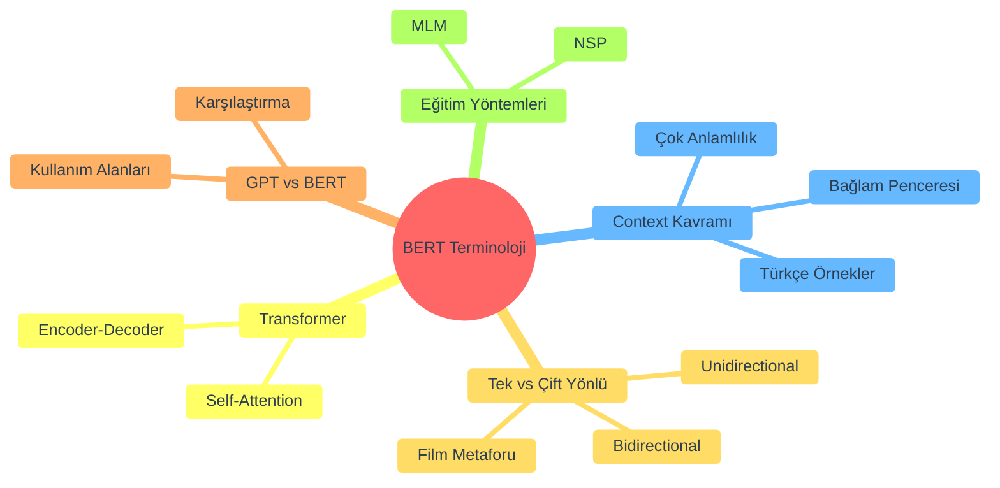
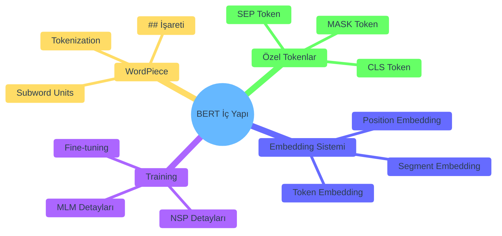
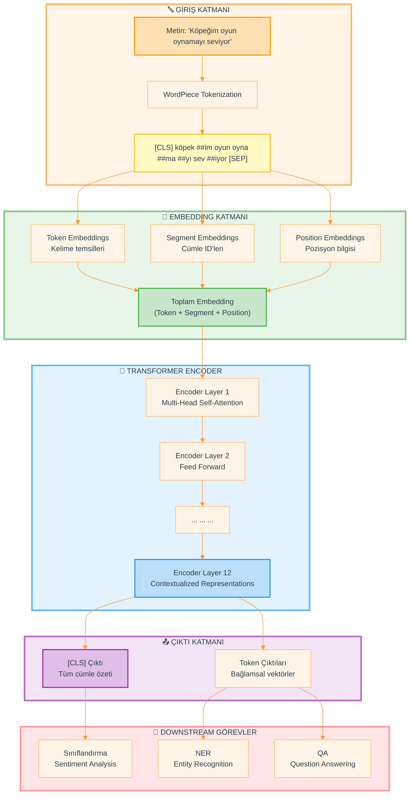
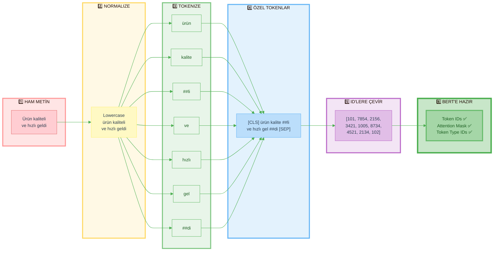
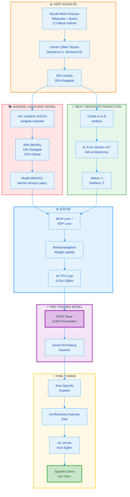
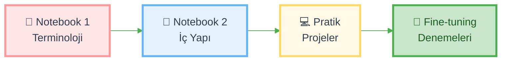

<div align="center">

```text
 ██████╗ ███████╗██████╗ ████████╗
 ██╔══██╗██╔════╝██╔══██╗╚══██╔══╝
 ██████╔╝█████╗  ██████╔╝   ██║   
 ██╔══██╗██╔══╝  ██╔══██╗   ██║   
 ██████╔╝███████╗██║  ██║   ██║   
 ╚═════╝ ╚══════╝╚═╝  ╚═╝   ╚═╝   
                                   
   Architecture Theory & Deep Dive
```


### 🎓 BERT Mimari Teori ve Derin Analiz

**Bidirectional Encoder Representations from Transformers**  
*Doğal Dil İşleme'de Devrim Yaratan Mimari*

---

[](https://python.org)
[](https://huggingface.co/transformers)
[](LICENSE)
[](https://github.com)

</div>

---

## 🌟 Genel Bakış

Bu klasör, **BERT (Bidirectional Encoder Representations from Transformers)** mimarisinin derinlemesine incelenmesini içeren kapsamlı eğitim materyallerini barındırmaktadır. Modern NLP'nin temel taşlarından biri olan BERT'in teorik temellerinden pratik uygulamalarına kadar her şeyi öğreneceksiniz.

### 🎯 Bu Modül Size Neler Kazandıracak?

<table>
<tr>
<td width="50%">

**📚 Teorik Derinlik**
- ✅ Bağlam (Context) kavramının temelleri
- ✅ Çift yönlü (Bidirectional) anlama felsefesi
- ✅ Transformer mimarisinin BERT'e uyarlanması
- ✅ Self-Attention mekanizmasının gücü

</td>
<td width="50%">

**🛠️ Pratik Uygulama**
- ✅ WordPiece tokenization detayları
- ✅ Embedding katmanlarının yapısı
- ✅ MLM ve NSP eğitim stratejileri
- ✅ Fine-tuning ve transfer learning

</td>
</tr>
</table>

### 🎓 Hedef Kitle

- 📖 **Yeni Başlayanlar:** Hiç NLP bilmeyenler için sıfırdan anlatım
- 🚀 **Orta Seviye:** Transformer kavramlarını pekiştirmek isteyenler
- 🔬 **İleri Düzey:** BERT'in iç mekaniklerini anlamak isteyenler
- 💼 **YBS Öğrencileri:** Gerçek dünya uygulamaları ve iş senaryoları

---

## � İçindekiler

- [🌟 Genel Bakış](#-genel-bakış)
- [📂 Klasör İçeriği](#-klasör-içeriği)
  - [📓 Notebook 1: BERT Paper & Terminology](#-notebook-1-bert-paper--terminology)
  - [📓 Notebook 2: WordPiece & Training Fundamentals](#-notebook-2-wordpiece--training-fundamentals)
- [🎨 BERT Mimarisi Görselleştirme](#-bert-mimarisi-görselleştirme)
- [🔄 Tokenization Pipeline](#-tokenization-pipeline)
- [🎓 Training Pipeline](#-training-pipeline)
- [🚀 Nasıl Kullanılır](#-nasıl-kullanılır)
- [📚 Öğrenme Yol Haritası](#-öğrenme-yol-haritası)
- [⚙️ Gereksinimler](#️-gereksinimler)
- [💡 İpuçları](#-i̇puçları)
- [📖 Kaynaklar](#-kaynaklar)

---

## 📂 Klasör İçeriği

Bu klasörde **2 temel notebook** bulunmaktadır:

### 📓 Notebook 1: BERT Paper & Terminology

**Dosya:** `01.bertpaper-terminology.ipynb`  
**Süre:** ~120 dakika  
**Seviye:** 🟢 Başlangıç → 🟡 Orta

#### 🎯 Ne Öğreneceksiniz?

<div align="left">



</div>

#### 📋 Bölüm Detayları

| Adım | Konu | Açıklama | Süre |
|------|------|----------|------|
| **1** | 🎯 Bağlam (Context) | Kelime anlamlarının bağlama göre değişimi | 20 dk |
| **2** | 🎬 Tek vs Çift Yönlü | Film metaforu ile unidirectional/bidirectional farkı | 25 dk |
| **3** | 🏗️ Transformer Temelleri | Encoder-Decoder mimarisi, Self-Attention | 30 dk |
| **4** | 🤖 GPT vs BERT | İki mimarinin karşılaştırmalı analizi | 20 dk |
| **5** | 📚 MLM & NSP | Masked Language Model ve Next Sentence Prediction | 25 dk |

#### 💡 Öne Çıkan Özellikler

- ✨ Günlük hayattan örneklerle bağlam kavramı
- 🎭 Türkçe çok anlamlı kelimeler (yüz, kol, anahtar)
- 📊 İnteraktif Python kod örnekleri
- 💼 YBS perspektifinden gerçek dünya senaryoları
- 🎨 Görsel diyagramlar ve ASCII art
- 🔍 Adım adım detaylı açıklamalar

---

### 📓 Notebook 2: WordPiece & Training Fundamentals

**Dosya:** `02.bert-wordpiece-and-training-fundamentals.ipynb`  
**Süre:** ~180 dakika  
**Seviye:** 🟡 Orta → 🔴 İleri

#### 🎯 Ne Öğreneceksiniz?

<div align="left">



</div>

#### 📋 Bölüm Detayları

| Adım | Konu | Açıklama | Süre |
|------|------|----------|------|
| **1** | ✂️ WordPiece Tokenization | Kelimeleri neden ve nasıl parçalıyoruz | 35 dk |
| **2** | 🏷️ Özel Tokenlar | [CLS], [SEP], [MASK] token'larının işlevi | 30 dk |
| **3** | 🧩 Üç Katmanlı Embedding | Token + Segment + Position embedding sistemi | 40 dk |
| **4** | 🎓 BERT Eğitimi | MLM ve NSP eğitim stratejileri detaylı | 45 dk |
| **5** | 🔄 Fine-tuning | Transfer learning ve downstream görevler | 30 dk |

#### 💡 Öne Çıkan Özellikler

- 🔬 Hugging Face Transformers kütüphanesi kullanımı
- 🛠️ Gerçek kod örnekleri ve uygulamalar
- 📊 E-ticaret müşteri yorumu analizi senaryosu
- 🎨 Mermaid diyagramları ile görselleştirme
- 🧪 İnteraktif tokenization deneyleri
- 💻 Pratik fine-tuning örnekleri

---

## 🎨 BERT Mimarisi Görselleştirme

### 🏗️ BERT Genel Mimari

BERT'in temel mimarisini ve bilgi akışını gösteren kapsamlı diyagram:



### 🔑 Mimari Bileşenleri

| Katman | İşlev | Detay |
|--------|-------|-------|
| 🔤 **Giriş** | Metin → Token | WordPiece ile parçalama, özel token'lar ekleme |
| 🧩 **Embedding** | Token → Vektör | 3 tip embedding'in toplamı (Token+Segment+Position) |
| 🔄 **Transformer** | Vektör → Bağlam | 12 katman (Base) veya 24 katman (Large) encoder |
| 📤 **Çıktı** | Bağlam → Temsil | Her token için bağlamsal vektör |
| 🎯 **Task** | Fine-tuning | Sınıflandırma, NER, QA vb. görevler |

---

## 🔄 Tokenization Pipeline

### ✂️ WordPiece Tokenization Süreci

Bir cümlenin nasıl token'lara dönüştürüldüğünü adım adım gösteren diyagram:



### 🔍 Tokenization Örnek Analizi

| Orijinal | Token'lar | Açıklama |
|----------|-----------|----------|
| **"playing"** | `["play", "##ing"]` | Kök + ek ayrımı |
| **"unbelievable"** | `["un", "##believe", "##able"]` | Önek + kök + sonek |
| **"kitaplık"** | `["kitap", "##lık"]` | Türkçe kök + ek |
| **"oynamayı"** | `["oyun", "##ma", "##yı"]` | Çoklu ek yapısı |

> 💡 **Not:** `##` işareti, token'ın kelimenin başında değil, devamı olduğunu gösterir!

---

## 🎓 Training Pipeline

### 📚 BERT Eğitim Süreci

BERT'in nasıl eğitildiğini gösteren tam pipeline:



### 🎯 Eğitim Stratejileri Karşılaştırma

<table>
<tr>
<th width="25%">🎭 MLM</th>
<th width="25%">🔗 NSP</th>
<th width="25%">⚖️ Combined</th>
<th width="25%">🔧 Fine-tuning</th>
</tr>
<tr>
<td>

**Amaç:**  
Maskelenmiş kelimeleri tahmin et

**Örnek:**  
"Köpeğim [MASK] seviyor"  
→ "oynamayı"

</td>
<td>

**Amaç:**  
İki cümle ardışık mı?

**Örnek:**  
A: "Hava güzel"  
B: "Yürüyüşe çıktım"  
→ IsNext ✅

</td>
<td>

**Sonuç:**  
İki görev birlikte

**Fayda:**  
Hem kelime hem de cümle seviyesi anlama

</td>
<td>

**Süreç:**  
Küçük dataset ile hızlı adaptasyon

**Avantaj:**  
Transfer learning gücü

</td>
</tr>
</table>

---

## 🚀 Nasıl Kullanılır

### 📥 1. Gerekli Kurulumlar

```bash
# Python ortamı oluştur (isteğe bağlı ama önerilen)
python -m venv bert_env
bert_env\Scripts\activate  # Windows
# source bert_env/bin/activate  # Linux/Mac

# Gerekli kütüphaneleri yükle
pip install transformers torch jupyter numpy pandas matplotlib
```

### 📚 2. Notebook'ları Çalıştırma

```bash
# Jupyter Notebook başlat
jupyter notebook

# Tarayıcıda açılan sayfadan sırasıyla:
# 1. 01.bertpaper-terminology.ipynb
# 2. 02.bert-wordpiece-and-training-fundamentals.ipynb
```

### 🎯 3. Önerilen Çalışma Sırası



---

## 📚 Öğrenme Yol Haritası

### 🗓️ Haftalık Plan

<table>
<tr>
<th width="15%">Hafta</th>
<th width="35%">Konu</th>
<th width="30%">Aktivite</th>
<th width="20%">Hedef</th>
</tr>
<tr>
<td align="center"><strong>1️⃣</strong></td>
<td>📓 <strong>Notebook 1</strong><br/>BERT Terminoloji</td>
<td>
• Her bölümü dikkatlice oku<br/>
• Kod örneklerini çalıştır<br/>
• Flash card'ları ezberle
</td>
<td>Temel kavramları anlama</td>
</tr>
<tr>
<td align="center"><strong>2️⃣</strong></td>
<td>📓 <strong>Notebook 2</strong><br/>WordPiece & Training</td>
<td>
• Tokenization deneyleri yap<br/>
• Embedding sistemini öğren<br/>
• MLM/NSP'yi uygula
</td>
<td>İç mekanikleri kavrama</td>
</tr>
<tr>
<td align="center"><strong>3️⃣</strong></td>
<td>💻 <strong>Pratik Proje</strong><br/>Kendi Dataset'in</td>
<td>
• Hugging Face kullan<br/>
• Sentiment analysis yap<br/>
• Kendi verinle fine-tune et
</td>
<td>Gerçek uygulama deneyimi</td>
</tr>
<tr>
<td align="center"><strong>4️⃣</strong></td>
<td>🚀 <strong>İleri Seviye</strong><br/>Optimizasyon</td>
<td>
• Farklı BERT varyantları<br/>
• Hiperparametre tuning<br/>
• Production deployment
</td>
<td>Profesyonel seviye</td>
</tr>
</table>

### 🎓 Öğrenme İpuçları

> 💡 **Başarı için 5 Altın Kural:**
>
> 1. **📖 Sabırlı Ol:** BERT karmaşık bir mimari, her şeyi ilk seferde anlamak zorunda değilsin
> 2. **💻 Pratik Yap:** Sadece okumakla yetinme, her kod bloğunu çalıştır
> 3. **🤔 Soru Sor:** Anlamadığın yerleri işaretle ve araştır
> 4. **🔄 Tekrar Et:** Bazı kavramları anlamak için 2-3 kez gözden geçir
> 5. **👥 Paylaş:** Öğrendiklerini başkalarına anlat, bu en iyi pekiştirme yöntemidir

---

## ⚙️ Gereksinimler

### 🐍 Python ve Kütüphaneler

```python
# requirements.txt
transformers>=4.35.0
torch>=2.0.0
jupyter>=1.0.0
numpy>=1.24.0
pandas>=2.0.0
matplotlib>=3.7.0
seaborn>=0.12.0
```

### 💻 Sistem Gereksinimleri

| Bileşen | Minimum | Önerilen |
|---------|---------|----------|
| **Python** | 3.8+ | 3.10+ |
| **RAM** | 8 GB | 16 GB+ |
| **Disk** | 5 GB | 10 GB+ |
| **GPU** | Yok (CPU ile çalışır) | NVIDIA GPU (CUDA) |

### 🌐 Online Alternatifler

Yerel kurulum yapamıyorsan:
- 🔵 **Google Colab:** Ücretsiz GPU ile çalıştır
- 🟣 **Kaggle Notebooks:** Hazır ortamda dene
- 🟢 **Hugging Face Spaces:** Demo oluştur ve paylaş

---

## 💡 İpuçları

### 🎯 Verimli Çalışma Stratejileri

<table>
<tr>
<td width="50%">

**✅ YAPILMASI GEREKENLER**

- 📝 Her bölüm sonunda notlar al
- 💻 Kod örneklerini değiştirerek dene
- 🎨 Diyagramları kendi kelimelerinle çiz
- 🤔 "Neden?" sorularını sor
- 📊 Farklı örneklerle test et
- 👥 Çalışma grubu oluştur

</td>
<td width="50%">

**❌ YAPILMAMASI GEREKENLER**

- 🚫 Sadece hızlıca göz gezdirme
- 🚫 Kod çalıştırmadan geçme
- 🚫 Anlamamışken devam etme
- 🚫 Bir seferde hepsini bitirmeye çalışma
- 🚫 Pratik yapmadan teoride kalma
- 🚫 Yalnız çalışıp yardım istememe

</td>
</tr>
</table>

### 🐛 Sık Karşılaşılan Sorunlar

<details>
<summary><strong>❓ BERT çok yavaş çalışıyor</strong></summary>

**Çözümler:**
- Daha küçük bir model kullan: `bert-base-uncased` → `distilbert-base-uncased`
- Batch size'ı azalt
- Sequence length'i kısalt (512 → 128)
- GPU kullan veya Google Colab'a geç

</details>

<details>
<summary><strong>❓ "Out of Memory" hatası alıyorum</strong></summary>

**Çözümler:**
- Batch size'ı küçült (32 → 16 → 8)
- Gradient accumulation kullan
- Mixed precision training dene (`fp16=True`)
- Daha küçük bir model seç

</details>

<details>
<summary><strong>❓ Tokenizer Türkçe metinlerde iyi çalışmıyor</strong></summary>

**Çözümler:**
- Türkçe için özel eğitilmiş model kullan: `dbmdz/bert-base-turkish-cased`
- Veya multilingual model: `bert-base-multilingual-cased`
- Kendi tokenizer'ınızı eğitin (ileri seviye)

</details>

<details>
<summary><strong>❓ Fine-tuning sonuçları kötü</strong></summary>

**Çözümler:**
- Learning rate'i ayarla (genellikle 2e-5 - 5e-5 arası)
- Daha fazla epoch dene
- Dataset'ini dengele (class imbalance kontrolü)
- Pre-trained model seçimini gözden geçir
- Data augmentation uygula

</details>

---

## 📖 Kaynaklar

### 📄 Orijinal Makaleler

1. **BERT Paper (2018)**  
   [BERT: Pre-training of Deep Bidirectional Transformers for Language Understanding](https://arxiv.org/abs/1810.04805)  
   *Jacob Devlin, Ming-Wei Chang, Kenton Lee, Kristina Toutanova*

2. **Attention is All You Need (2017)**  
   [Transformer Architecture](https://arxiv.org/abs/1706.03762)  
   *Vaswani et al.*

### 🌐 Online Kaynaklar

| Kaynak | Açıklama | Link |
|--------|----------|------|
| 🤗 **Hugging Face** | BERT Dökümantasyonu | [transformers.docs](https://huggingface.co/docs/transformers) |
| 📺 **Jay Alammar** | Görsel BERT Açıklamaları | [The Illustrated BERT](http://jalammar.github.io/illustrated-bert/) |
| 📚 **Papers With Code** | BERT Implementations | [paperswithcode.com](https://paperswithcode.com/method/bert) |
| 🎓 **Stanford CS224N** | NLP Dersleri | [web.stanford.edu/class/cs224n/](https://web.stanford.edu/class/cs224n/) |

### 📚 Türkçe Kaynaklar

- 🇹🇷 **Türkçe NLP Workshop:** Pratik örnekler ve topluluk
- 🇹🇷 **Turkish BERT Models:** `dbmdz/bert-base-turkish-cased`
- 🇹🇷 **NLP Turkey Community:** Discord ve GitHub grubu

### 🎥 Video Kaynakları

- 📺 **StatQuest:** BERT clearly explained (İngilizce, görsel)
- 📺 **Yannic Kilcher:** BERT paper walkthrough (Detaylı)
- 📺 **DeepLearning.AI:** NLP Specialization (Coursera)

---

## ⭐ Teşekkürler

Bu notebook'ları faydalı bulduysan:
- ⭐ GitHub repo'ya yıldız ver
- 🔄 Arkadaşlarınla paylaş
- 📝 Geri bildirim bırak
- 🤝 Topluluğa katıl

---

<div align="center">

### 🎓 Mutlu Öğrenmeler! 

**"BERT'ü anlamak, modern NLP'nin kapılarını açmaktır."**

Made with ❤️ for NLP Enthusiasts by Cemal YÜKSEL | 2026

---

⬆️ [Başa Dön](#-i̇çindekiler)

</div>
