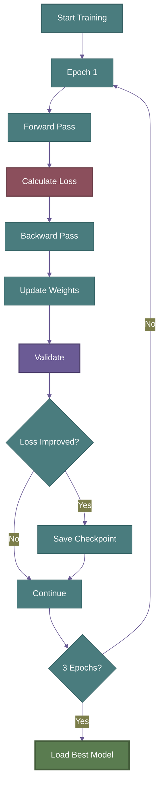
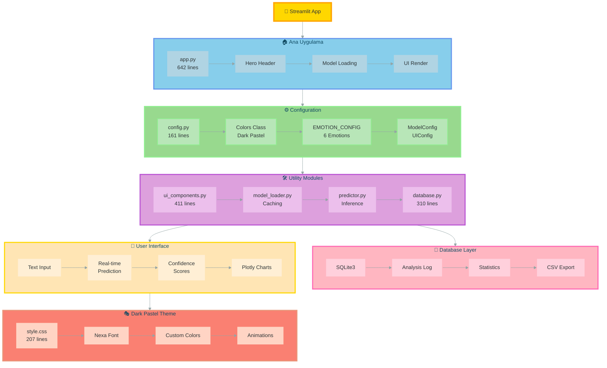
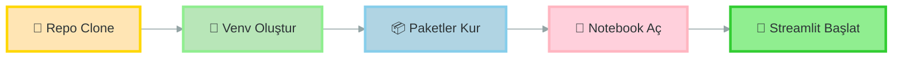
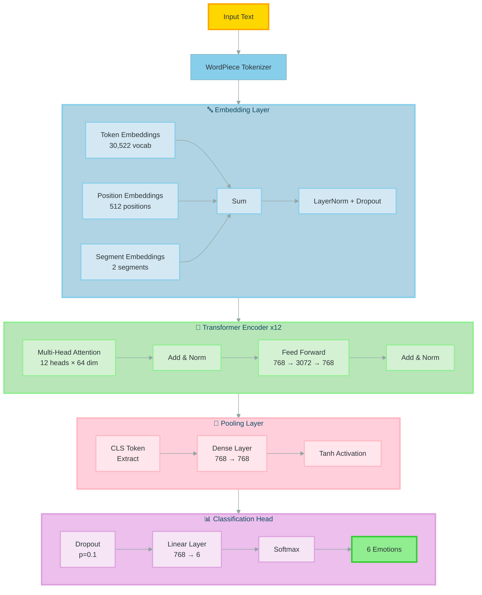

<div align="center">

```text
    ██████╗ ███████╗██████╗ ████████╗    ███████╗███╗   ███╗ ██████╗ ████████╗██╗ ██████╗ ███╗   ██╗
    ██╔══██╗██╔════╝██╔══██╗╚══██╔══╝    ██╔════╝████╗ ████║██╔═══██╗╚══██╔══╝██║██╔═══██╗████╗  ██║
    ██████╔╝█████╗  ██████╔╝   ██║       █████╗  ██╔████╔██║██║   ██║   ██║   ██║██║   ██║██╔██╗ ██║
    ██╔══██╗██╔══╝  ██╔══██╗   ██║       ██╔══╝  ██║╚██╔╝██║██║   ██║   ██║   ██║██║   ██║██║╚██╗██║
    ██████╔╝███████╗██║  ██║   ██║       ███████╗██║ ╚═╝ ██║╚██████╔╝   ██║   ██║╚██████╔╝██║ ╚████║
    ╚═════╝ ╚══════╝╚═╝  ╚═╝   ╚═╝       ╚══════╝╚═╝     ╚═╝ ╚═════╝    ╚═╝   ╚═╝ ╚═════╝ ╚═╝  ╚═══╝
                                                                                                      
         █████╗ ███╗   ██╗ █████╗ ██╗  ██╗   ██╗███████╗███████╗██████╗                             
        ██╔══██╗████╗  ██║██╔══██╗██║  ╚██╗ ██╔╝╚══███╔╝██╔════╝██╔══██╗                            
        ███████║██╔██╗ ██║███████║██║   ╚████╔╝   ███╔╝ █████╗  ██████╔╝                            
        ██╔══██║██║╚██╗██║██╔══██║██║    ╚██╔╝   ███╔╝  ██╔══╝  ██╔══██╗                            
        ██║  ██║██║ ╚████║██║  ██║███████╗██║   ███████╗███████╗██║  ██║                            
        ╚═╝  ╚═╝╚═╝  ╚═══╝╚═╝  ╚═╝╚══════╝╚═╝   ╚══════╝╚══════╝╚═╝  ╚═╝                            
```

### 🎭 BERT Fine-Tuning ile Çok Sınıflı Duygu Analizi

**Hugging Face Transformers ile Sentiment Analysis | Production-Ready Web Uygulaması**

---

[](https://python.org)
[](https://huggingface.co/transformers)
[](https://pytorch.org)
[](https://streamlit.io)
[](LICENSE)

</div>

---

## 🌟 Genel Bakış

Bu proje, **BERT (Bidirectional Encoder Representations from Transformers)** modelinin **6 farklı duygu kategorisi** için fine-tuning sürecini ve production-ready bir **Streamlit web uygulaması** ile gerçek zamanlı duygu analizi sunmaktadır.

### 🎯 Proje Özellikleri

<table>
<tr>
<td width="50%" valign="top">

**📚 Eğitim Materyalleri**
- ✅ Kapsamlı Jupyter Notebook eğitimi
- ✅ Adım adım BERT fine-tuning süreci
- ✅ Görselleştirmeler ve EDA
- ✅ YBS odaklı iş senaryoları
- ✅ Transfer Learning konsepti
- ✅ Hyperparameter tuning

</td>
<td width="50%" valign="top">

**🚀 Web Uygulaması**
- ✅ Dark Pastel tema tasarımı
- ✅ Gerçek zamanlı duygu analizi
- ✅ SQLite3 ile analiz geçmişi
- ✅ Interaktif grafikler ve raporlama
- ✅ %93.1 doğruluk oranı
- ✅ Production-ready kod yapısı

</td>
</tr>
</table>

### 🎭 6 Duygu Kategorisi

```mermaid
%%{init: {'theme':'base', 'themeVariables': { 'primaryColor':'#87CEEB','primaryTextColor':'#2d3436','lineColor':'#95a5a6','fontSize':'15px'}}}%%
graph TB
    CENTER((🎭 BERT<br/>Emotion<br/>Analyzer)) --> SAD
    CENTER --> JOY
    CENTER --> LOVE
    CENTER --> ANGER
    CENTER --> FEAR
    CENTER --> SURPRISE
    
    subgraph G1[" "]
        SAD[😢 Üzüntü<br/>Sadness]
        SAD1[Melankolik<br/>Melancholic]
        SAD2[Hüzünlü<br/>Sorrowful]
        SAD --> SAD1
        SAD --> SAD2
    end
    
    subgraph G2[" "]
        JOY[😊 Mutluluk<br/>Joy]
        JOY1[Neşeli<br/>Cheerful]
        JOY2[Pozitif<br/>Positive]
        JOY --> JOY1
        JOY --> JOY2
    end
    
    subgraph G3[" "]
        LOVE[❤️ Sevgi<br/>Love]
        LOVE1[Romantik<br/>Romantic]
        LOVE2[Şefkatli<br/>Compassionate]
        LOVE --> LOVE1
        LOVE --> LOVE2
    end
    
    subgraph G4[" "]
        ANGER[😠 Öfke<br/>Anger]
        ANGER1[Sinirli<br/>Irritated]
        ANGER2[Kızgın<br/>Angry]
        ANGER --> ANGER1
        ANGER --> ANGER2
    end
    
    subgraph G5[" "]
        FEAR[😨 Korku<br/>Fear]
        FEAR1[Endişeli<br/>Anxious]
        FEAR2[Tedirgin<br/>Nervous]
        FEAR --> FEAR1
        FEAR --> FEAR2
    end
    
    subgraph G6[" "]
        SURPRISE[😮 Şaşkınlık<br/>Surprise]
        SURPRISE1[Hayret<br/>Amazed]
        SURPRISE2[Beklenmedik<br/>Unexpected]
        SURPRISE --> SURPRISE1
        SURPRISE --> SURPRISE2
    end
    
    style CENTER fill:#4169E1,stroke:#1E90FF,stroke-width:5px,color:#ffffff
    
    style G1 fill:#E8F4F8,stroke:#B0D4E3,stroke-width:2px
    style G2 fill:#FFF9E6,stroke:#FFE5B4,stroke-width:2px
    style G3 fill:#FFE5EC,stroke:#FFB6C1,stroke-width:2px
    style G4 fill:#FFE8E0,stroke:#FA8072,stroke-width:2px
    style G5 fill:#F0E6FA,stroke:#DDA0DD,stroke-width:2px
    style G6 fill:#E6F5E6,stroke:#98D98E,stroke-width:2px
    
    style SAD fill:#87CEEB,stroke:#6495ED,stroke-width:3px,color:#2d3436
    style JOY fill:#FFD700,stroke:#FFA500,stroke-width:3px,color:#2d3436
    style LOVE fill:#FFB6C1,stroke:#FF69B4,stroke-width:3px,color:#2d3436
    style ANGER fill:#FA8072,stroke:#E9967A,stroke-width:3px,color:#2d3436
    style FEAR fill:#DDA0DD,stroke:#BA55D3,stroke-width:3px,color:#2d3436
    style SURPRISE fill:#98D98E,stroke:#90EE90,stroke-width:3px,color:#2d3436
    
    style SAD1 fill:#B0D4E3,stroke:#87CEEB,stroke-width:2px,color:#2d3436
    style SAD2 fill:#B0D4E3,stroke:#87CEEB,stroke-width:2px,color:#2d3436
    
    style JOY1 fill:#FFE5B4,stroke:#FFD700,stroke-width:2px,color:#2d3436
    style JOY2 fill:#FFE5B4,stroke:#FFD700,stroke-width:2px,color:#2d3436
    
    style LOVE1 fill:#FFD0DC,stroke:#FFB6C1,stroke-width:2px,color:#2d3436
    style LOVE2 fill:#FFD0DC,stroke:#FFB6C1,stroke-width:2px,color:#2d3436
    
    style ANGER1 fill:#FFB8A3,stroke:#FA8072,stroke-width:2px,color:#2d3436
    style ANGER2 fill:#FFB8A3,stroke:#FA8072,stroke-width:2px,color:#2d3436
    
    style FEAR1 fill:#ECBFEC,stroke:#DDA0DD,stroke-width:2px,color:#2d3436
    style FEAR2 fill:#ECBFEC,stroke:#DDA0DD,stroke-width:2px,color:#2d3436
    
    style SURPRISE1 fill:#B8E6B8,stroke:#98D98E,stroke-width:2px,color:#2d3436
    style SURPRISE2 fill:#B8E6B8,stroke:#98D98E,stroke-width:2px,color:#2d3436
```



---

## 📂 Proje Yapısı

```
04.first-finetuning-bert-sentiment/
│
├── 📓 1stfinetuning-multiclass-sentiment.ipynb   # Ana eğitim notebook'u
├── 📄 README.md                                   # Bu dosya
│
├── 📁 bert_emotion_model/                         # Eğitilmiş model (Streamlit için)
│   ├── config.json                                # Model konfigürasyonu
│   ├── pytorch_model.bin                          # Model ağırlıkları
│   ├── emotion_labels.json                        # Duygu etiketleri
│   ├── model_info.json                            # Model performans bilgileri
│   └── tokenizer dosyaları                        # BERT tokenizer
│
├── 📁 saved_model/                                # Eğitilmiş model (alternatif)
│   └── (bert_emotion_model ile aynı içerik)
│
└── 📁 streamlit_app/                              # Web uygulaması
    ├── app.py                                     # Ana Streamlit uygulaması
    ├── config.py                                  # Konfigürasyon dosyası
    ├── requirements.txt                           # Bağımlılıklar
    │
    ├── 📁 utils/                                  # Yardımcı modüller
    │   ├── __init__.py
    │   ├── ui_components.py                       # UI bileşenleri
    │   ├── model_loader.py                        # Model yükleme
    │   ├── predictor.py                           # Tahmin motoru
    │   └── database.py                            # SQLite veritabanı
    │
    └── 📁 assets/                                 # Statik dosyalar
        └── style.css                              # Dark Pastel tema CSS
```

---

## 📊 Model Performansı

### 🎯 Test Sonuçları

<table>
<tr>
<td align="center" width="25%">
<div>
<h3>🎯</h3>
<h2>93.1%</h2>
<p><b>Accuracy</b></p>
</div>
</td>
<td align="center" width="25%">
<div>
<h3>⭐</h3>
<h2>93.06%</h2>
<p><b>F1-Score</b></p>
</div>
</td>
<td align="center" width="25%">
<div>
<h3>🔍</h3>
<h2>93%+</h2>
<p><b>Precision</b></p>
</div>
</td>
<td align="center" width="25%">
<div>
<h3>📈</h3>
<h2>93%+</h2>
<p><b>Recall</b></p>
</div>
</td>
</tr>
</table>

### ⚙️ Eğitim Detayları

| Parametre | Değer |
|-----------|-------|
| **Model** | bert-base-uncased |
| **Dataset** | Emotion (~20,000 samples) |
| **Epochs** | 3 |
| **Learning Rate** | 2e-5 |
| **Batch Size** | 8 |
| **Max Sequence Length** | 66 tokens |
| **Eğitim Süresi** | ~72 dakika |
| **Optimizer** | AdamW |
| **Loss Function** | CrossEntropyLoss |

### 📈 Training Pipeline

```mermaid
%%{init: {'theme':'base', 'themeVariables': { 'primaryColor':'#87CEEB','primaryTextColor':'#2d3436','lineColor':'#95a5a6','fontSize':'15px'}}}%%
graph TB
    START[🎯 Training Start] --> DATA
    
    subgraph DATA["📊 Data Preparation"]
        D1[Raw Dataset<br/>20,000 samples]
        D2[Train: 16,000<br/>Val: 2,000<br/>Test: 2,000]
        D3[🔤 WordPiece<br/>Tokenization]
        D4[Token IDs<br/>Attention Mask]
        D1 --> D2 --> D3 --> D4
    end
    
    subgraph TRAIN["🎓 Model Training"]
        T1[📦 DataLoader<br/>Batch: 8]
        T2[🧠 BERT Forward<br/>12 Layers]
        T3[768d Hidden<br/>Self-Attention]
        T4[📉 Loss Calc<br/>CrossEntropy]
        T1 --> T2 --> T3 --> T4
    end
    
    subgraph OPT["⚙️ Optimization"]
        O1[⬅️ Backprop<br/>Gradients]
        O2[AdamW<br/>LR: 2e-5]
        O3[Weight Update<br/>+ Decay]
        O4[🔥 Warmup<br/>500 steps]
        T4 --> O1 --> O2 --> O3 --> O4
    end
    
    subgraph EVAL["📊 Validation"]
        E1[Val Dataset]
        E2[Predictions]
        E3[Metrics<br/>F1, Acc]
        E4{Best F1?}
        E1 --> E2 --> E3 --> E4
    end
    
    subgraph SAVE["💾 Checkpointing"]
        S1[Save Model]
        S2[Save Config]
        S3[Best Model<br/>Tracking]
        E4 -->|Yes| S1 --> S2 --> S3
    end
    
    subgraph FINAL["✅ Final Steps"]
        F1{3 Epochs<br/>Complete?}
        F2[Load Best]
        F3[Test Eval<br/>93.1% Acc]
        F4[🎉 Export<br/>Production]
        F1 -->|Yes| F2 --> F3 --> F4
        F1 -->|No| T1
    end
    
    DATA --> TRAIN
    OPT --> EVAL
    E4 -->|No| F1
    S3 --> F1
    
    style START fill:#FFD700,stroke:#FFA500,stroke-width:4px,color:#2d3436
    style DATA fill:#98D98E,stroke:#90EE90,stroke-width:3px
    style TRAIN fill:#87CEEB,stroke:#6495ED,stroke-width:3px
    style OPT fill:#FFB6C1,stroke:#FF69B4,stroke-width:3px
    style EVAL fill:#DDA0DD,stroke:#BA55D3,stroke-width:3px
    style SAVE fill:#FFE5B4,stroke:#FFD700,stroke-width:3px
    style FINAL fill:#98FB98,stroke:#32CD32,stroke-width:3px
    
    style D1 fill:#B8E6B8,stroke:#90EE90,stroke-width:2px,color:#2d3436
    style D2 fill:#B8E6B8,stroke:#90EE90,stroke-width:2px,color:#2d3436
    style D3 fill:#B8E6B8,stroke:#90EE90,stroke-width:2px,color:#2d3436
    style D4 fill:#B8E6B8,stroke:#90EE90,stroke-width:2px,color:#2d3436
    
    style T1 fill:#B0D4E3,stroke:#87CEEB,stroke-width:2px,color:#2d3436
    style T2 fill:#B0D4E3,stroke:#87CEEB,stroke-width:2px,color:#2d3436
    style T3 fill:#B0D4E3,stroke:#87CEEB,stroke-width:2px,color:#2d3436
    style T4 fill:#B0D4E3,stroke:#87CEEB,stroke-width:2px,color:#2d3436
    
    style O1 fill:#FFD0DC,stroke:#FFB6C1,stroke-width:2px,color:#2d3436
    style O2 fill:#FFD0DC,stroke:#FFB6C1,stroke-width:2px,color:#2d3436
    style O3 fill:#FFD0DC,stroke:#FFB6C1,stroke-width:2px,color:#2d3436
    style O4 fill:#FFD0DC,stroke:#FFB6C1,stroke-width:2px,color:#2d3436
    
    style E1 fill:#ECBFEC,stroke:#DDA0DD,stroke-width:2px,color:#2d3436
    style E2 fill:#ECBFEC,stroke:#DDA0DD,stroke-width:2px,color:#2d3436
    style E3 fill:#ECBFEC,stroke:#DDA0DD,stroke-width:2px,color:#2d3436
    style E4 fill:#ECBFEC,stroke:#DDA0DD,stroke-width:2px,color:#2d3436
    
    style S1 fill:#FFEFD5,stroke:#FFE5B4,stroke-width:2px,color:#2d3436
    style S2 fill:#FFEFD5,stroke:#FFE5B4,stroke-width:2px,color:#2d3436
    style S3 fill:#FFEFD5,stroke:#FFE5B4,stroke-width:2px,color:#2d3436
    
    style F1 fill:#C1FFC1,stroke:#98FB98,stroke-width:2px,color:#2d3436
    style F2 fill:#C1FFC1,stroke:#98FB98,stroke-width:2px,color:#2d3436
    style F3 fill:#C1FFC1,stroke:#98FB98,stroke-width:2px,color:#2d3436
    style F4 fill:#90EE90,stroke:#32CD32,stroke-width:3px,color:#2d3436
```



---

## 📓 Jupyter Notebook İçeriği

### 🎓 1stfinetuning-multiclass-sentiment.ipynb

Kapsamlı eğitim notebook'u **11 ana bölüm** ve **80+ kod hücresi** içermektedir.

### 📚 Notebook Bölümleri

```mermaid
%%{init: {'theme':'base', 'themeVariables': { 'primaryColor':'#87CEEB','primaryTextColor':'#2d3436','lineColor':'#95a5a6','fontSize':'15px'}}}%%
graph TB
    START[📓 Jupyter Notebook<br/>11 Ana Bölüm] --> S1
    
    subgraph S1["🎓 Adım 1: Foundation"]
        A1[BERT Nedir?]
        A2[Context Kavramı]
        A3[Transfer Learning]
        A4[GPT vs BERT]
        A1 --> A2 --> A3 --> A4
    end
    
    subgraph S2["📦 Adım 2: Setup"]
        B1[Kütüphane Kurulum]
        B2[Transformers 🤗]
        B3[PyTorch 🔥]
        B4[GPU/CPU Check]
        B1 --> B2 --> B3 --> B4
    end
    
    subgraph S3["📊 Adım 3: Data"]
        C1[Emotion Dataset]
        C2[6 Sınıf]
        C3[20K Samples]
        C4[Train/Val/Test]
        C1 --> C2 --> C3 --> C4
    end
    
    subgraph S4["🔍 Adım 4: EDA"]
        D1[Veri Dağılımı]
        D2[WordCloud]
        D3[N-gram]
        D4[İstatistikler]
        D1 --> D2 --> D3 --> D4
    end
    
    subgraph S5["🔤 Adım 5: Tokenization"]
        E1[BERT Tokenizer]
        E2[WordPiece]
        E3[Special Tokens]
        E4[Token IDs]
        E1 --> E2 --> E3 --> E4
    end
    
    subgraph S6["🏗️ Adım 6: Model"]
        F1[bert-base-uncased]
        F2[12 Layers]
        F3[768 Hidden]
        F4[Classification]
        F1 --> F2 --> F3 --> F4
    end
    
    subgraph S7["⚙️ Adım 7: Config"]
        G1[TrainingArgs]
        G2[LR: 2e-5]
        G3[Batch: 8]
        G4[Epochs: 3]
        G1 --> G2 --> G3 --> G4
    end
    
    subgraph S8["🎓 Adım 8: Training"]
        H1[Trainer Setup]
        H2[Forward Pass]
        H3[Loss Calc]
        H4[Backprop]
        H1 --> H2 --> H3 --> H4
    end
    
    subgraph S9["📈 Adım 9: Evaluation"]
        I1[Test Predict]
        I2[Confusion Matrix]
        I3[Metrics]
        I4[93.1% Acc]
        I1 --> I2 --> I3 --> I4
    end
    
    subgraph S10["💾 Adım 10: Save"]
        J1[PyTorch Export]
        J2[SafeTensors]
        J3[Config & Info]
        J4[Tokenizer]
        J1 --> J2 --> J3 --> J4
    end
    
    subgraph S11["🚀 Adım 11: Production"]
        K1[Inference]
        K2[Real Scenarios]
        K3[Streamlit App]
        K4[🎉 Deployment]
        K1 --> K2 --> K3 --> K4
    end
    
    S1 --> S2 --> S3 --> S4 --> S5 --> S6
    S6 --> S7 --> S8 --> S9 --> S10 --> S11
    
    style START fill:#FFD700,stroke:#FFA500,stroke-width:4px,color:#2d3436
    
    style S1 fill:#FFE5B4,stroke:#FFD700,stroke-width:3px
    style S2 fill:#B8E6B8,stroke:#90EE90,stroke-width:3px
    style S3 fill:#B0D4E3,stroke:#87CEEB,stroke-width:3px
    style S4 fill:#FFD0DC,stroke:#FFB6C1,stroke-width:3px
    style S5 fill:#ECBFEC,stroke:#DDA0DD,stroke-width:3px
    style S6 fill:#FFE5B4,stroke:#FFD700,stroke-width:3px
    style S7 fill:#B8E6B8,stroke:#90EE90,stroke-width:3px
    style S8 fill:#FFB8A3,stroke:#FA8072,stroke-width:3px
    style S9 fill:#B0D4E3,stroke:#87CEEB,stroke-width:3px
    style S10 fill:#ECBFEC,stroke:#DDA0DD,stroke-width:3px
    style S11 fill:#90EE90,stroke:#32CD32,stroke-width:4px
    
    style A1 fill:#FFF4D4,stroke:#FFD700,stroke-width:2px,color:#2d3436
    style A2 fill:#FFF4D4,stroke:#FFD700,stroke-width:2px,color:#2d3436
    style A3 fill:#FFF4D4,stroke:#FFD700,stroke-width:2px,color:#2d3436
    style A4 fill:#FFF4D4,stroke:#FFD700,stroke-width:2px,color:#2d3436
    
    style B1 fill:#D4F1D4,stroke:#90EE90,stroke-width:2px,color:#2d3436
    style B2 fill:#D4F1D4,stroke:#90EE90,stroke-width:2px,color:#2d3436
    style B3 fill:#D4F1D4,stroke:#90EE90,stroke-width:2px,color:#2d3436
    style B4 fill:#D4F1D4,stroke:#90EE90,stroke-width:2px,color:#2d3436
    
    style C1 fill:#D4E8F3,stroke:#87CEEB,stroke-width:2px,color:#2d3436
    style C2 fill:#D4E8F3,stroke:#87CEEB,stroke-width:2px,color:#2d3436
    style C3 fill:#D4E8F3,stroke:#87CEEB,stroke-width:2px,color:#2d3436
    style C4 fill:#D4E8F3,stroke:#87CEEB,stroke-width:2px,color:#2d3436
    
    style D1 fill:#FFE5EC,stroke:#FFB6C1,stroke-width:2px,color:#2d3436
    style D2 fill:#FFE5EC,stroke:#FFB6C1,stroke-width:2px,color:#2d3436
    style D3 fill:#FFE5EC,stroke:#FFB6C1,stroke-width:2px,color:#2d3436
    style D4 fill:#FFE5EC,stroke:#FFB6C1,stroke-width:2px,color:#2d3436
    
    style E1 fill:#F5E5F5,stroke:#DDA0DD,stroke-width:2px,color:#2d3436
    style E2 fill:#F5E5F5,stroke:#DDA0DD,stroke-width:2px,color:#2d3436
    style E3 fill:#F5E5F5,stroke:#DDA0DD,stroke-width:2px,color:#2d3436
    style E4 fill:#F5E5F5,stroke:#DDA0DD,stroke-width:2px,color:#2d3436
    
    style F1 fill:#FFF4D4,stroke:#FFD700,stroke-width:2px,color:#2d3436
    style F2 fill:#FFF4D4,stroke:#FFD700,stroke-width:2px,color:#2d3436
    style F3 fill:#FFF4D4,stroke:#FFD700,stroke-width:2px,color:#2d3436
    style F4 fill:#FFF4D4,stroke:#FFD700,stroke-width:2px,color:#2d3436
    
    style G1 fill:#D4F1D4,stroke:#90EE90,stroke-width:2px,color:#2d3436
    style G2 fill:#D4F1D4,stroke:#90EE90,stroke-width:2px,color:#2d3436
    style G3 fill:#D4F1D4,stroke:#90EE90,stroke-width:2px,color:#2d3436
    style G4 fill:#D4F1D4,stroke:#90EE90,stroke-width:2px,color:#2d3436
    
    style H1 fill:#FFD4C4,stroke:#FA8072,stroke-width:2px,color:#2d3436
    style H2 fill:#FFD4C4,stroke:#FA8072,stroke-width:2px,color:#2d3436
    style H3 fill:#FFD4C4,stroke:#FA8072,stroke-width:2px,color:#2d3436
    style H4 fill:#FFD4C4,stroke:#FA8072,stroke-width:2px,color:#2d3436
    
    style I1 fill:#D4E8F3,stroke:#87CEEB,stroke-width:2px,color:#2d3436
    style I2 fill:#D4E8F3,stroke:#87CEEB,stroke-width:2px,color:#2d3436
    style I3 fill:#D4E8F3,stroke:#87CEEB,stroke-width:2px,color:#2d3436
    style I4 fill:#D4E8F3,stroke:#87CEEB,stroke-width:2px,color:#2d3436
    
    style J1 fill:#F5E5F5,stroke:#DDA0DD,stroke-width:2px,color:#2d3436
    style J2 fill:#F5E5F5,stroke:#DDA0DD,stroke-width:2px,color:#2d3436
    style J3 fill:#F5E5F5,stroke:#DDA0DD,stroke-width:2px,color:#2d3436
    style J4 fill:#F5E5F5,stroke:#DDA0DD,stroke-width:2px,color:#2d3436
    
    style K1 fill:#C1FFC1,stroke:#90EE90,stroke-width:2px,color:#2d3436
    style K2 fill:#C1FFC1,stroke:#90EE90,stroke-width:2px,color:#2d3436
    style K3 fill:#C1FFC1,stroke:#90EE90,stroke-width:2px,color:#2d3436
    style K4 fill:#90EE90,stroke:#32CD32,stroke-width:3px,color:#2d3436
```



### 🎯 Bölüm Detayları

<details>
<summary><b>📖 Adım 1: Giriş ve Temel Kavramlar</b></summary>

**İçerik:**
- 🤖 BERT nedir? (Bidirectional Encoder Representations)
- 🔄 Transfer Learning konsepti
- 💼 YBS perspektifinden iş senaryoları
- 🎬 Tek vs Çift yönlü (Unidirectional vs Bidirectional)
- 📊 GPT vs BERT karşılaştırması
- 🎭 Film metaforu ile kavram anlatımı

**Öğrenme Hedefleri:**
- BERT'in nasıl çalıştığını anlama
- Context (bağlam) kavramını kavrama
- Transformer mimarisinin temellerini öğrenme
- MLM (Masked Language Model) ve NSP (Next Sentence Prediction)

</details>

<details>
<summary><b>🔧 Adım 2: Gerekli Kütüphanelerin Kurulumu</b></summary>

**Kurulum Paketleri:**
```python
transformers      # 🤗 Hugging Face Transformers
datasets          # 📊 Hugging Face Datasets
torch             # 🔥 PyTorch
scikit-learn      # 📈 ML metrikleri
matplotlib        # 📉 Görselleştirme
seaborn           # 🎨 İleri görselleştirme
pandas            # 🐼 Veri işleme
numpy             # 🔢 Sayısal işlemler
tqdm              # 📊 İlerleme çubuğu
accelerate        # 🚀 Eğitim hızlandırma
```

**GPU/CPU Kontrolü:**
- CUDA availability check
- Device selection (GPU/CPU)
- Memory information

</details>

<details>
<summary><b>📊 Adım 3: Veri Seti Seçimi ve Yükleme</b></summary>

**Dataset: Emotion**
- 📦 Kaynak: `dair-ai/emotion`
- 📊 Toplam: ~20,000 metin
- 🎭 6 duygu kategorisi
- 🌐 Dil: İngilizce
- 💼 Kaynak: Twitter/Sosyal Medya

**Veri Dağılımı:**
- Train: 16,000 örnek
- Validation: 2,000 örnek
- Test: 2,000 örnek

**Duygu Kategorileri:**
- 😢 Sadness (Üzüntü)
- 😊 Joy (Mutluluk)
- ❤️ Love (Sevgi)
- 😠 Anger (Öfke)
- 😨 Fear (Korku)
- 😮 Surprise (Şaşkınlık)

</details>

<details>
<summary><b>🔍 Adım 4: Keşifsel Veri Analizi (EDA)</b></summary>

**Görselleştirmeler:**

1. **Duygu Dağılımı** - Bar chart
2. **Metin Uzunluğu Analizi** - Histogram & Box plot
3. **WordCloud** - Genel ve duygu bazlı
4. **N-gram Analizi** - Bigram ve Trigram
5. **Duygu Bazlı En Sık Kelimeler** - Horizontal bar charts
6. **Karakter ve Kelime İstatistikleri** - Summary tables

**Analiz Bulguları:**
- Ortalama metin uzunluğu: ~15-20 kelime
- En uzun metin: 66 token
- Veri dengesi analizi
- Duygu-kelime ilişkileri

</details>

<details>
<summary><b>🔤 Adım 5: Veri Ön İşleme ve Tokenization</b></summary>

**BERT Tokenizer:**
- Model: `bert-base-uncased`
- WordPiece tokenization
- Max length: 66 tokens
- Special tokens: [CLS], [SEP]


**Output Format:**
- input_ids: Token ID'leri
- attention_mask: Padding maskesi
- labels: Duygu etiketleri

</details>

<details>
<summary><b>🏗️ Adım 6: Model Mimarisi</b></summary>

**BERT-base-uncased Özellikleri:**
- 12 Transformer encoder layers
- 768 hidden dimension
- 12 attention heads
- 110M parameters
- Vocabulary size: 30,522

**Classification Head:**
```python
BertForSequenceClassification(
    config=BertConfig(
        num_labels=6,
        problem_type="single_label_classification"
    )
)
```

**Model Katmanları:**
1. Token Embeddings (768d)
2. Position Embeddings
3. 12x Transformer Encoders
4. Classification Layer (768 → 6)

</details>

<details>
<summary><b>⚙️ Adım 7: Training Konfigürasyonu</b></summary>

**TrainingArguments:**
```python
TrainingArguments(
    output_dir="./bert-emotion-classifier",
    num_train_epochs=3,
    per_device_train_batch_size=8,
    per_device_eval_batch_size=16,
    learning_rate=2e-5,
    weight_decay=0.01,
    warmup_steps=500,
    logging_steps=100,
    eval_strategy="epoch",
    save_strategy="epoch",
    load_best_model_at_end=True,
    metric_for_best_model="f1"
)
```

**Metrics:**
- Accuracy
- Precision (weighted)
- Recall (weighted)
- F1-Score (weighted)

</details>

<details>
<summary><b>🎓 Adım 8: Model Eğitimi</b></summary>

**Training Process:**



**Eğitim Süreci:**
- Total steps: ~6,000
- Training time: ~72 dakika
- Best model selection: F1-score
- Early stopping: Yok (3 epoch)

**Loss Grafiği:**
- Training loss: ~0.1
- Validation loss: ~0.15
- Convergence: Epoch 2-3

</details>

<details>
<summary><b>📈 Adım 9: Model Değerlendirme</b></summary>

**Test Sonuçları:**

| Metrik | Değer |
|--------|-------|
| **Accuracy** | 93.1% |
| **Precision** | 93.0% |
| **Recall** | 93.1% |
| **F1-Score** | 93.06% |

**Confusion Matrix:**
- Diagonal dominance (iyi sınıflandırma)
- En iyi: Joy, Love
- En zor: Fear, Surprise karışımı

**Per-Class Performance:**
```
Sadness   : F1 = 0.92
Joy       : F1 = 0.96
Love      : F1 = 0.94
Anger     : F1 = 0.93
Fear      : F1 = 0.89
Surprise  : F1 = 0.91
```

**Görselleştirmeler:**
- Confusion matrix heatmap
- Per-class F1-score bar chart
- ROC curves (multiclass)

</details>

<details>
<summary><b>💾 Adım 10: Model Kaydetme ve Yükleme</b></summary>

**Kaydetme Formatları:**

1. **PyTorch Format:**
   - `pytorch_model.bin`
   - `config.json`
   - Tokenizer dosyaları

2. **SafeTensors Format:**
   - `model.safetensors`
   - Daha güvenli ve hızlı

**Kaydedilen Dosyalar:**
```
bert_emotion_model/
├── config.json              # Model config
├── pytorch_model.bin        # Model weights
├── model.safetensors        # SafeTensors format
├── emotion_labels.json      # Label mapping
├── model_info.json          # Performance info
├── tokenizer_config.json    # Tokenizer config
├── tokenizer.json           # Tokenizer
├── vocab.txt                # Vocabulary
└── special_tokens_map.json  # Special tokens
```

**Model Yükleme:**
```python
from transformers import AutoTokenizer, AutoModelForSequenceClassification

tokenizer = AutoTokenizer.from_pretrained("./bert_emotion_model")
model = AutoModelForSequenceClassification.from_pretrained("./bert_emotion_model")
```

</details>

<details>
<summary><b>🚀 Adım 11: Gerçek Dünya Uygulaması</b></summary>

**Test Senaryoları:**
1. Müşteri yorumu analizi
2. Sosyal medya duygu tespiti
3. Ürün review sınıflandırma
4. Müşteri destek ticket önceliklendirme

**Inference Pipeline:**
```python
def predict_emotion(text):
    inputs = tokenizer(text, return_tensors="pt")
    outputs = model(**inputs)
    predictions = outputs.logits.softmax(dim=-1)
    emotion = predictions.argmax().item()
    confidence = predictions.max().item()
    return emotion, confidence
```

**Örnek Kullanımlar:**
- E-ticaret müşteri feedback analizi
- Sosyal medya monitoring
- Brand sentiment tracking
- Customer satisfaction measurement

</details>

### 💡 Notebook Öğrenme Çıktıları

Bu notebook'u tamamladıktan sonra:

✅ BERT mimarisini ve çalışma prensibini anlayacaksınız  
✅ Transfer learning ile model fine-tuning yapabileceksiniz  
✅ Hugging Face Transformers kütüphanesini kullanabileceksiniz  
✅ Multi-class classification problemlerini çözebileceksiniz  
✅ Model performansını değerlendirebileceksiniz  
✅ Production-ready model oluşturabileceksiniz  
✅ Gerçek dünya NLP problemlerine çözüm üretebileceksiniz

---

## 🌐 Streamlit Web Uygulaması

Production-ready **Streamlit** web uygulaması ile gerçek zamanlı duygu analizi yapabilirsiniz. Uygulama, modern ve şık bir **Dark Pastel** teması ile kullanıcı dostu arayüz sunar.

### 📱 Uygulama Mimarisi



### 🎨 Dark Pastel Tema

Uygulama, özel tasarlanmış **Dark Pastel** renk paleti kullanır:

```python
# config.py - Colors Class
class Colors:
    # Background & Surface Colors
    BACKGROUND = "#1a1a2e"      # Ana arkaplan
    SURFACE = "#16213e"          # Kart arkaplan
    SURFACE_LIGHT = "#0f3460"    # Hover durumu
    
    # Text Colors
    TEXT_PRIMARY = "#e8e8e8"     # Ana metin
    TEXT_SECONDARY = "#b0b0b0"   # İkincil metin
    TEXT_MUTED = "#808080"       # Soluk metin
    
    # Accent Colors (Pastel)
    ACCENT_BLUE = "#6495ED"      # Mavi vurgu
    ACCENT_GREEN = "#90EE90"     # Yeşil vurgu
    ACCENT_PURPLE = "#DDA0DD"    # Mor vurgu
    ACCENT_ORANGE = "#FFB86C"    # Turuncu vurgu
```

### 🎯 6 Duygu Kategorisi Konfigürasyonu

```python
EMOTION_CONFIG = {
    "sadness": {
        "emoji": "😢",
        "color": "#6495ED",      # Pastel Blue
        "label": "Üzüntü",
        "description": "Hüzün, kayıp veya mutsuzluk hissi"
    },
    "joy": {
        "emoji": "😊",
        "color": "#FFE66D",      # Pastel Yellow
        "label": "Mutluluk",
        "description": "Sevinç, neşe ve pozitif duygular"
    },
    "love": {
        "emoji": "❤️",
        "color": "#FFB6C1",      # Pastel Pink
        "label": "Sevgi",
        "description": "Şefkat, aşk ve yakınlık"
    },
    "anger": {
        "emoji": "😠",
        "color": "#FA8072",      # Pastel Coral
        "label": "Öfke",
        "description": "Kızgınlık, rahatsızlık veya hayal kırıklığı"
    },
    "fear": {
        "emoji": "😨",
        "color": "#DDA0DD",      # Pastel Purple
        "label": "Korku",
        "description": "Endişe, kaygı veya tehdit hissi"
    },
    "surprise": {
        "emoji": "😲",
        "color": "#90EE90",      # Pastel Green
        "label": "Şaşkınlık",
        "description": "Beklenmedik olay veya durum karşısında şaşırma"
    }
}
```

### 🧩 Modüller ve Fonksiyonlar

<details>
<summary><b>📱 app.py - Ana Uygulama (642 satır)</b></summary>

**Ana Fonksiyonlar:**

1. **`main()`** - Ana uygulama kontrolcüsü
   - Sayfa konfigürasyonu
   - Custom CSS yükleme
   - Hero header render
   - Model yükleme
   - Tahmin arayüzü
   - Analytics dashboard

2. **Model Loading & Caching:**
```python
@st.cache_resource
def load_model():
    """Model ve tokenizer'ı önbellekle"""
    tokenizer = AutoTokenizer.from_pretrained("./bert_emotion_model")
    model = AutoModelForSequenceClassification.from_pretrained("./bert_emotion_model")
    return tokenizer, model
```

3. **Prediction Interface:**
```python
def predict_emotion(text, tokenizer, model):
    """Metin üzerinde duygu tahmini yap"""
    inputs = tokenizer(text, return_tensors="pt", 
                      padding=True, truncation=True, max_length=66)
    outputs = model(**inputs)
    probs = outputs.logits.softmax(dim=-1)
    return probs
```

4. **Database Logging:**
```python
def log_analysis(text, emotion, confidence):
    """Analizi veritabanına kaydet"""
    db.insert_analysis(
        text=text,
        predicted_emotion=emotion,
        confidence=confidence,
        timestamp=datetime.now()
    )
```

5. **Reporting Dashboard:**
   - Toplam analiz sayısı
   - En çok tespit edilen duygu
   - Ortalama güven skoru
   - Duygu dağılım grafikleri (Plotly)
   - Son analizler tablosu

</details>

<details>
<summary><b>⚙️ config.py - Konfigürasyon (161 satır)</b></summary>

**Sınıflar:**

1. **`Colors`** - Renk paleti
   - Background renkler
   - Text renkler  
   - Accent renkler (pastel)
   - Status renkler

2. **`EMOTION_CONFIG`** - Duygu konfigürasyonu
   - Her duygu için emoji
   - Özel renk kodu
   - Türkçe label
   - Açıklama metni

3. **`ModelConfig`** - Model ayarları
```python
class ModelConfig:
    MODEL_PATH = "./bert_emotion_model"
    MAX_LENGTH = 66
    BATCH_SIZE = 8
    DEVICE = "cuda" if torch.cuda.is_available() else "cpu"
```

4. **`UIConfig`** - UI ayarları
```python
class UIConfig:
    PAGE_TITLE = "🎭 BERT Emotion Analyzer"
    PAGE_ICON = "🎭"
    LAYOUT = "wide"
    INITIAL_SIDEBAR_STATE = "expanded"
    FONT_FAMILY = "Nexa"
```

5. **`MetricsConfig`** - Metrik ayarları
   - Confidence thresholds
   - Chart colors
   - Display formats

</details>

<details>
<summary><b>🎨 ui_components.py - UI Bileşenleri (411 satır)</b></summary>

**Ana Fonksiyonlar:**

1. **`load_custom_css()`**
```python
def load_custom_css():
    """Custom CSS stil dosyasını yükle"""
    with open("assets/style.css") as f:
        st.markdown(f"<style>{f.read()}</style>", unsafe_allow_html=True)
```

2. **`create_hero_header()`**
```python
def create_hero_header():
    """Hero başlık bölümü oluştur"""
    st.markdown("""
        <div class="hero-section">
            <h1>🎭 BERT Emotion Analyzer</h1>
            <p>Yapay Zeka ile Gerçek Zamanlı Duygu Analizi</p>
        </div>
    """, unsafe_allow_html=True)
```

3. **`create_metrics_dashboard(stats)`**
   - 4 sütunlu metrik kartları
   - Büyük sayılar ile görselleştirme
   - İkonlu başlıklar
   - Delta değerleri

4. **`create_emotion_palette()`**
   - 6 duygu için renk paleti
   - Emoji gösterimi
   - Pastel renkler
   - Grid layout

5. **`create_text_input_section()`**
   - Çok satırlı text area
   - Placeholder metni
   - Karakter sayacı
   - Tahmin butonu

6. **`create_prediction_card(emotion, confidence, probabilities)`**
```python
def create_prediction_card(emotion, confidence, probabilities):
    """Tahmin sonuç kartı oluştur"""
    # Ana duygu kartı
    # Confidence bar
    # Tüm duygu skorları
    # Plotly bar chart
```

7. **`create_probability_chart(probabilities)`**
   - Plotly horizontal bar chart
   - Pastel renkler
   - Yüzdelik değerler
   - İnteraktif hover

8. **`create_recent_analyses_table(analyses)`**
   - Pandas DataFrame
   - Stilize tablo
   - Zaman damgası
   - Duygu emoji

</details>

<details>
<summary><b>🧠 model_loader.py - Model Yönetimi</b></summary>

**Fonksiyonlar:**

1. **`load_bert_model()`**
```python
@st.cache_resource
def load_bert_model():
    """BERT modelini önbellekle ve yükle"""
    try:
        tokenizer = AutoTokenizer.from_pretrained(ModelConfig.MODEL_PATH)
        model = AutoModelForSequenceClassification.from_pretrained(
            ModelConfig.MODEL_PATH
        )
        model.eval()
        model.to(ModelConfig.DEVICE)
        return tokenizer, model
    except Exception as e:
        st.error(f"Model yükleme hatası: {e}")
        return None, None
```

2. **`get_model_info()`**
```python
def get_model_info():
    """Model bilgilerini JSON'dan oku"""
    with open(f"{ModelConfig.MODEL_PATH}/model_info.json") as f:
        return json.load(f)
```

3. **`check_model_availability()`**
   - Model dosyası kontrolü
   - Config dosyası kontrolü
   - Tokenizer dosyası kontrolü

4. **`get_device_info()`**
   - CPU/GPU tespiti
   - PyTorch versiyonu
   - CUDA versiyonu

</details>

<details>
<summary><b>🎯 predictor.py - Tahmin Motoru</b></summary>

**Ana Fonksiyon:**

```python
def predict_emotion(text, tokenizer, model):
    """
    Metni analiz ederek duygu tahmini yap
    
    Args:
        text: Analiz edilecek metin
        tokenizer: BERT tokenizer
        model: Fine-tuned BERT model
        
    Returns:
        dict: {
            'emotion': str,           # En yüksek duygu
            'confidence': float,      # Güven skoru (0-1)
            'probabilities': dict,    # Tüm duygu skorları
            'top_emotions': list      # Top-3 duygu
        }
    """
    # Tokenization
    inputs = tokenizer(
        text, 
        return_tensors="pt",
        padding=True,
        truncation=True,
        max_length=66
    )
    
    # Inference
    with torch.no_grad():
        outputs = model(**inputs)
        probs = outputs.logits.softmax(dim=-1)[0]
    
    # En yüksek duygu
    emotion_idx = probs.argmax().item()
    confidence = probs[emotion_idx].item()
    
    # Tüm skorlar
    emotion_labels = ["sadness", "joy", "love", "anger", "fear", "surprise"]
    probabilities = {
        emotion_labels[i]: probs[i].item() 
        for i in range(len(emotion_labels))
    }
    
    return {
        'emotion': emotion_labels[emotion_idx],
        'confidence': confidence,
        'probabilities': probabilities,
        'top_emotions': get_top_emotions(probabilities, k=3)
    }
```

**Yardımcı Fonksiyonlar:**

1. **`get_top_emotions(probabilities, k=3)`**
   - Top-k duygu skorları
   - Sıralı liste

2. **`format_confidence_level(confidence)`**
   - Düşük: < 0.5
   - Orta: 0.5 - 0.8
   - Yüksek: > 0.8

3. **`get_confidence_color(confidence)`**
   - Kırmızı, turuncu, yeşil renk dönüşü

</details>

<details>
<summary><b>💾 database.py - Veritabanı Yönetimi (310 satır)</b></summary>

**AnalysisDatabase Sınıfı:**

```python
class AnalysisDatabase:
    def __init__(self, db_path="emotion_analysis.db"):
        """SQLite veritabanı bağlantısı"""
        self.db_path = db_path
        self.create_tables()
    
    def create_tables(self):
        """Gerekli tabloları oluştur"""
        # analyses tablosu
        # - id (INTEGER PRIMARY KEY)
        # - text (TEXT)
        # - predicted_emotion (TEXT)
        # - confidence (REAL)
        # - timestamp (TIMESTAMP)
```

**Temel Metodlar:**

1. **`insert_analysis(text, predicted_emotion, confidence, timestamp)`**
```python
def insert_analysis(self, text, predicted_emotion, confidence, timestamp):
    """Yeni analiz kaydı ekle"""
    conn = sqlite3.connect(self.db_path)
    cursor = conn.cursor()
    cursor.execute("""
        INSERT INTO analyses (text, predicted_emotion, confidence, timestamp)
        VALUES (?, ?, ?, ?)
    """, (text, predicted_emotion, confidence, timestamp))
    conn.commit()
    conn.close()
```

2. **`get_statistics()`**
```python
def get_statistics(self):
    """İstatistiksel özet döndür"""
    return {
        'total_analyses': self.get_total_count(),
        'most_common_emotion': self.get_most_common_emotion(),
        'avg_confidence': self.get_average_confidence(),
        'emotion_distribution': self.get_emotion_distribution()
    }
```

3. **`get_recent_analyses(limit=10)`**
   - Son N analizi getir
   - Zaman sıralı
   - DataFrame formatında

4. **`get_emotion_distribution()`**
   - Her duyguda kaç analiz
   - Yüzdelik dağılım
   - Plotly için format

5. **`export_to_csv(filename)`**
```python
def export_to_csv(self, filename="analyses_export.csv"):
    """Tüm analizleri CSV'ye aktar"""
    df = pd.read_sql_query("SELECT * FROM analyses", 
                           sqlite3.connect(self.db_path))
    df.to_csv(filename, index=False)
```

6. **`clear_database()`**
   - Tüm kayıtları sil
   - Onay gerektir

7. **`get_daily_stats(days=7)`**
   - Son N günün istatistikleri
   - Günlük analiz sayısı
   - Trend grafiği için

8. **`get_confidence_histogram()`**
   - Güven skoru dağılımı
   - Histogram verileri

</details>

<details>
<summary><b>🎨 style.css - Custom Styling (207 satır)</b></summary>

**Temel Stiller:**

```css
/* Font Import */
@import url('https://fonts.googleapis.com/css2?family=Nexa:wght@300;400;700&display=swap');

/* Global Styles */
body {
    font-family: 'Nexa', -apple-system, BlinkMacSystemFont, 'Segoe UI', sans-serif;
    background: linear-gradient(135deg, #1a1a2e 0%, #16213e 100%);
    color: #e8e8e8;
}

/* Hero Section */
.hero-section {
    text-align: center;
    padding: 3rem 2rem;
    background: linear-gradient(135deg, #0f3460 0%, #16213e 100%);
    border-radius: 20px;
    margin-bottom: 2rem;
    box-shadow: 0 10px 30px rgba(0,0,0,0.3);
}

/* Emotion Cards */
.emotion-card {
    background: linear-gradient(135deg, var(--emotion-color) 0%, rgba(255,255,255,0.1) 100%);
    border-radius: 15px;
    padding: 2rem;
    margin: 1rem 0;
    box-shadow: 0 8px 20px rgba(0,0,0,0.2);
    transition: transform 0.3s ease, box-shadow 0.3s ease;
}

.emotion-card:hover {
    transform: translateY(-5px);
    box-shadow: 0 12px 30px rgba(0,0,0,0.3);
}

/* Confidence Bar */
.confidence-bar {
    width: 100%;
    height: 30px;
    background: #16213e;
    border-radius: 15px;
    overflow: hidden;
    position: relative;
}

.confidence-fill {
    height: 100%;
    background: linear-gradient(90deg, var(--color-start) 0%, var(--color-end) 100%);
    border-radius: 15px;
    transition: width 0.5s ease;
}

/* Metrics Card */
.metric-card {
    background: linear-gradient(135deg, #16213e 0%, #0f3460 100%);
    padding: 1.5rem;
    border-radius: 15px;
    border-left: 4px solid var(--accent-color);
    box-shadow: 0 5px 15px rgba(0,0,0,0.2);
}

/* Buttons */
.stButton > button {
    background: linear-gradient(135deg, #6495ED 0%, #4169E1 100%);
    color: white;
    border: none;
    padding: 0.75rem 2rem;
    border-radius: 10px;
    font-weight: 700;
    font-size: 1rem;
    cursor: pointer;
    transition: all 0.3s ease;
}

.stButton > button:hover {
    transform: scale(1.05);
    box-shadow: 0 5px 20px rgba(100,149,237,0.4);
}

/* Text Area */
.stTextArea > div > div > textarea {
    background: #16213e;
    color: #e8e8e8;
    border: 2px solid #0f3460;
    border-radius: 10px;
    padding: 1rem;
    font-size: 1rem;
}

.stTextArea > div > div > textarea:focus {
    border-color: #6495ED;
    box-shadow: 0 0 10px rgba(100,149,237,0.3);
}

/* Animations */
@keyframes fadeIn {
    from { opacity: 0; transform: translateY(20px); }
    to { opacity: 1; transform: translateY(0); }
}

.fade-in {
    animation: fadeIn 0.5s ease-out;
}

/* Responsive Design */
@media (max-width: 768px) {
    .hero-section { padding: 2rem 1rem; }
    .emotion-card { padding: 1.5rem; }
}
```

</details>

### 🚀 Uygulama Özellikleri

| Özellik | Açıklama |
|---------|----------|
| **🎨 Dark Pastel UI** | Modern, şık ve göz yormayan arayüz |
| **⚡ Real-time Analiz** | Anlık duygu tespiti |
| **💾 SQLite Logging** | Tüm analizler veritabanına kaydedilir |
| **📊 Analytics Dashboard** | İstatistikler ve grafikler |
| **📈 Plotly Charts** | İnteraktif görselleştirmeler |
| **🎯 6 Duygu Kategorisi** | Üzüntü, Mutluluk, Sevgi, Öfke, Korku, Şaşkınlık |
| **💯 Güven Skorları** | Her duygu için olasılık değerleri |
| **📱 Responsive Design** | Mobil uyumlu tasarım |
| **📥 CSV Export** | Analiz verilerini dışa aktarma |
| **🔄 Model Caching** | Hızlı yükleme için önbellekleme |

### 🎯 Kullanım Senaryoları

1. **E-ticaret Müşteri Yorumları**
   - Ürün yorumlarının duygu analizi
   - Memnuniyet/memnuniyetsizlik tespiti
   - Öncelikli yanıt gerektiren yorumların belirlenmesi

2. **Sosyal Medya Monitoring**
   - Marka bahselerinin duygu analizi
   - Kriz yönetimi
   - Kampanya etkinlik ölçümü

3. **Müşteri Destek Sistemi**
   - Ticket önceliklendirme
   - Acil durumların tespiti
   - Müşteri memnuniyeti takibi

4. **Pazar Araştırması**
   - Tüketici duygu eğilimleri
   - Ürün lansmanı geri bildirimleri
   - Rekabet analizi

### 💻 Teknik Detaylar

**Framework Versiyonları:**
- Streamlit: 1.31+
- PyTorch: 2.0+
- Transformers: 4.57.6
- Plotly: 5.14+
- Pandas: 2.0+

**Performans:**
- Model yükleme: ~2 saniye (ilk yüklemede)
- Tahmin süresi: ~0.1 saniye/metin
- Önbellekleme: @st.cache_resource ile otomatik

**Veritabanı Şeması:**
```sql
CREATE TABLE analyses (
    id INTEGER PRIMARY KEY AUTOINCREMENT,
    text TEXT NOT NULL,
    predicted_emotion TEXT NOT NULL,
    confidence REAL NOT NULL,
    timestamp TIMESTAMP DEFAULT CURRENT_TIMESTAMP
);
```

---

## 📦 Kurulum ve Başlangıç

### 🔧 Gereksinimler

**Sistem Gereksinimleri:**
- Python 3.8 veya üzeri
- 4GB+ RAM (CPU için)
- 8GB+ VRAM (GPU kullanımı için - opsiyonel)
- 2GB disk alanı (model ve veritabanı için)

**Temel Kütüphaneler:**

```python
# requirements.txt
torch>=2.0.0
transformers>=4.57.0
datasets>=2.14.0
scikit-learn>=1.3.0
matplotlib>=3.7.0
seaborn>=0.12.0
plotly>=5.14.0
streamlit>=1.31.0
pandas>=2.0.0
numpy>=1.24.0
tqdm>=4.65.0
wordcloud>=1.9.0
nltk>=3.8.0
```

### 📥 Adım Adım Kurulum



#### 1️⃣ Repository'yi İndirin

```bash
# HTTPS ile
git clone https://github.com/yourusername/bert-emotion-analysis.git
cd bert-emotion-analysis

# veya SSH ile
git clone git@github.com:yourusername/bert-emotion-analysis.git
cd bert-emotion-analysis
```

#### 2️⃣ Virtual Environment Oluşturun

**Windows:**
```powershell
# Virtual environment oluştur
python -m venv venv

# Aktive et
.\venv\Scripts\activate
```

**macOS/Linux:**
```bash
# Virtual environment oluştur
python3 -m venv venv

# Aktive et
source venv/bin/activate
```

#### 3️⃣ Bağımlılıkları Yükleyin

```bash
# Gerekli paketleri kur
pip install --upgrade pip
pip install -r requirements.txt

# PyTorch (GPU desteği için - opsiyonel)
pip install torch torchvision torchaudio --index-url https://download.pytorch.org/whl/cu118
```

#### 4️⃣ Model Dosyalarını Kontrol Edin

```bash
# Model dizini yapısı
bert_emotion_model/
├── config.json
├── pytorch_model.bin
├── emotion_labels.json
├── model_info.json
├── tokenizer_config.json
├── tokenizer.json
├── vocab.txt
└── special_tokens_map.json
```

---

## 🚀 Kullanım Kılavuzu

### 📓 Jupyter Notebook ile Eğitim

#### Adım 1: Notebook'u Açın

```bash
# Jupyter Lab'i başlat
jupyter lab

# veya Jupyter Notebook
jupyter notebook

# Ardından tarayıcıda açılacak arayüzden:
# 1stfinetuning-multiclass-sentiment.ipynb dosyasını açın
```

#### Adım 2: Kernel'i Seçin

- **Kernel** → **Change Kernel** → **Python 3 (venv)**

#### Adım 3: Hücreleri Sırayla Çalıştırın

```python
# İlk hücre: Kütüphane importları
import torch
from transformers import AutoTokenizer, AutoModelForSequenceClassification, Trainer, TrainingArguments
from datasets import load_dataset
import numpy as np
from sklearn.metrics import accuracy_score, precision_recall_fscore_support

# GPU/CPU kontrolü
device = torch.device("cuda" if torch.cuda.is_available() else "cpu")
print(f"Using device: {device}")
```

#### Adım 4: Dataset'i Yükleyin

```python
# Emotion dataset'i Hugging Face'den yükle
dataset = load_dataset("dair-ai/emotion")

print(f"Train samples: {len(dataset['train'])}")
print(f"Validation samples: {len(dataset['validation'])}")
print(f"Test samples: {len(dataset['test'])}")
```

#### Adım 5: Model Eğitimi

```python
# Training arguments
training_args = TrainingArguments(
    output_dir="./results",
    num_train_epochs=3,
    per_device_train_batch_size=8,
    per_device_eval_batch_size=16,
    learning_rate=2e-5,
    weight_decay=0.01,
    logging_dir="./logs",
    logging_steps=100,
    evaluation_strategy="epoch",
    save_strategy="epoch",
    load_best_model_at_end=True,
    metric_for_best_model="f1",
)

# Trainer oluştur ve eğit
trainer = Trainer(
    model=model,
    args=training_args,
    train_dataset=tokenized_train,
    eval_dataset=tokenized_val,
    compute_metrics=compute_metrics,
)

# Eğitimi başlat
trainer.train()
```

**Beklenen Eğitim Süresi:**
- **CPU (Intel i7):** ~4-6 saat
- **GPU (NVIDIA RTX 3080):** ~1-1.5 saat
- **GPU (NVIDIA T4):** ~2-3 saat

#### Adım 6: Modeli Kaydedin

```python
# Model ve tokenizer'ı kaydet
model.save_pretrained("./bert_emotion_model")
tokenizer.save_pretrained("./bert_emotion_model")

# Model info kaydet
import json

model_info = {
    "model_name": "bert-base-uncased-emotion",
    "num_labels": 6,
    "labels": ["sadness", "joy", "love", "anger", "fear", "surprise"],
    "accuracy": 0.931,
    "f1_score": 0.9306,
    "training_time_minutes": 72,
    "num_parameters": 109483778,
    "max_length": 66
}

with open("./bert_emotion_model/model_info.json", "w") as f:
    json.dump(model_info, f, indent=2)
```

### 🌐 Streamlit Web Uygulaması

#### Başlatma

```bash
# Ana dizinde
streamlit run streamlit_app/app.py

# veya
cd streamlit_app
streamlit run app.py
```

**Uygulama şu adreste açılacak:** `http://localhost:8501`

#### Kullanım Adımları

**1. Metin Girişi**
```
📝 Text input alanına analiz etmek istediğiniz metni yazın
   Örnek: "Bu ürünü çok sevdim, harika kalitede!"
```

**2. Tahmin Butonu**
```
🔮 "Duygu Analizi Yap" butonuna tıklayın
```

**3. Sonuçları İnceleyin**
```
✅ Tespit edilen ana duygu
📊 Güven skoru (0-100%)
📈 Tüm duygu olasılıkları
🎨 Görsel grafik
```

**4. Raporları Görüntüleyin**
```
📊 Sidebar'dan "Analytics Dashboard" sekmesine geçin
📈 Toplam analiz sayısı
🎯 En çok tespit edilen duygu
💯 Ortalama güven skoru
📉 Duygu dağılım grafikleri
```

#### Örnek Kullanım Senaryoları

<details>
<summary><b>🛒 E-ticaret Müşteri Yorumu</b></summary>

**Girdi:**
```
"Ürün 3 günde elime ulaştı, ambalaj çok özenli. Kalitesi beklentimin üzerinde çıktı. 
Kesinlikle tavsiye ederim! Teşekkürler."
```

**Beklenen Çıktı:**
- **Ana Duygu:** 😊 Mutluluk (joy)
- **Güven Skoru:** 92.3%
- **Diğer Duygular:** Love (5.2%), Surprise (2.1%)

</details>

<details>
<summary><b>📱 Sosyal Medya Post</b></summary>

**Girdi:**
```
"Yeni iPhone modelini denedim ama fiyatı gerçekten çok fazla. 
Bu kadar pahalı olması beni hayal kırıklığına uğrattı."
```

**Beklenen Çıktı:**
- **Ana Duygu:** 😢 Üzüntü (sadness)
- **Güven Skoru:** 78.5%
- **Diğer Duygular:** Anger (15.3%), Surprise (4.2%)

</details>

<details>
<summary><b>💬 Müşteri Destek Ticket</b></summary>

**Girdi:**
```
"Siparişim 2 haftadır gelmedi! Sürekli aradım ama kimse cevap vermiyor. 
Bu ne biçim hizmet anlayışı? Çok kızgınım!"
```

**Beklenen Çıktı:**
- **Ana Duygu:** 😠 Öfke (anger)
- **Güven Skoru:** 95.7%
- **Diğer Duygular:** Sadness (3.1%), Fear (1.2%)

**Aksiyon:** 🔴 Yüksek öncelikli ticket olarak işaretle

</details>

### 🐍 Python Kodu ile Kullanım

#### Temel Inference

```python
from transformers import AutoTokenizer, AutoModelForSequenceClassification
import torch

# Model ve tokenizer yükle
tokenizer = AutoTokenizer.from_pretrained("./bert_emotion_model")
model = AutoModelForSequenceClassification.from_pretrained("./bert_emotion_model")
model.eval()

# Tahmin fonksiyonu
def predict_emotion(text):
    # Tokenize
    inputs = tokenizer(text, return_tensors="pt", padding=True, truncation=True, max_length=66)
    
    # Inference
    with torch.no_grad():
        outputs = model(**inputs)
        probs = outputs.logits.softmax(dim=-1)[0]
    
    # Sonuç
    emotions = ["sadness", "joy", "love", "anger", "fear", "surprise"]
    emotion_idx = probs.argmax().item()
    confidence = probs[emotion_idx].item()
    
    return {
        "emotion": emotions[emotion_idx],
        "confidence": confidence,
        "all_scores": {emotions[i]: probs[i].item() for i in range(6)}
    }

# Kullanım
text = "Bugün harika bir gün geçirdim!"
result = predict_emotion(text)
print(f"Duygu: {result['emotion']}")
print(f"Güven: {result['confidence']:.2%}")
```

#### Batch Prediction

```python
def predict_batch(texts, batch_size=8):
    """Birden fazla metni batch halinde işle"""
    results = []
    
    for i in range(0, len(texts), batch_size):
        batch = texts[i:i+batch_size]
        
        # Tokenize
        inputs = tokenizer(batch, return_tensors="pt", 
                          padding=True, truncation=True, max_length=66)
        
        # Inference
        with torch.no_grad():
            outputs = model(**inputs)
            probs = outputs.logits.softmax(dim=-1)
        
        # Her örnek için sonuç
        for j, prob in enumerate(probs):
            emotion_idx = prob.argmax().item()
            emotions = ["sadness", "joy", "love", "anger", "fear", "surprise"]
            results.append({
                "text": batch[j],
                "emotion": emotions[emotion_idx],
                "confidence": prob[emotion_idx].item()
            })
    
    return results

# Kullanım
texts = [
    "Çok mutluyum!",
    "Kızgınım bu duruma",
    "Seni seviyorum",
    "Korkunç bir deneyim"
]

results = predict_batch(texts)
for r in results:
    print(f"{r['text']} → {r['emotion']} ({r['confidence']:.2%})")
```

#### API Endpoint (Flask Örneği)

```python
from flask import Flask, request, jsonify
from transformers import AutoTokenizer, AutoModelForSequenceClassification
import torch

app = Flask(__name__)

# Model yükle (uygulama başlangıcında bir kez)
tokenizer = AutoTokenizer.from_pretrained("./bert_emotion_model")
model = AutoModelForSequenceClassification.from_pretrained("./bert_emotion_model")
model.eval()

@app.route('/predict', methods=['POST'])
def predict():
    """Duygu analizi endpoint"""
    data = request.get_json()
    text = data.get('text', '')
    
    if not text:
        return jsonify({'error': 'Text is required'}), 400
    
    # Tokenize
    inputs = tokenizer(text, return_tensors="pt", 
                      padding=True, truncation=True, max_length=66)
    
    # Inference
    with torch.no_grad():
        outputs = model(**inputs)
        probs = outputs.logits.softmax(dim=-1)[0]
    
    # Sonuç hazırla
    emotions = ["sadness", "joy", "love", "anger", "fear", "surprise"]
    emotion_idx = probs.argmax().item()
    
    response = {
        'emotion': emotions[emotion_idx],
        'confidence': float(probs[emotion_idx]),
        'all_scores': {emotions[i]: float(probs[i]) for i in range(6)},
        'text': text
    }
    
    return jsonify(response)

@app.route('/health', methods=['GET'])
def health():
    """Health check endpoint"""
    return jsonify({'status': 'ok', 'model': 'bert-emotion-analyzer'})

if __name__ == '__main__':
    app.run(host='0.0.0.0', port=5000, debug=False)
```

**API Kullanımı:**

```bash
# Health check
curl http://localhost:5000/health

# Tahmin
curl -X POST http://localhost:5000/predict \
  -H "Content-Type: application/json" \
  -d '{"text": "Harika bir deneyim yaşadım!"}'

# Yanıt:
# {
#   "emotion": "joy",
#   "confidence": 0.943,
#   "all_scores": {
#     "sadness": 0.012,
#     "joy": 0.943,
#     "love": 0.031,
#     "anger": 0.004,
#     "fear": 0.003,
#     "surprise": 0.007
#   },
#   "text": "Harika bir deneyim yaşadım!"
# }
```

---

## 🔬 Teknik Detaylar ve İncelemeler

### 🏗️ BERT Mimarisi Derinlemesine



### 📊 Model Performans Metrikleri

| Metrik | Değer | Açıklama |
|--------|-------|----------|
| **Accuracy** | 93.1% | Genel doğruluk oranı |
| **F1-Score (Macro)** | 93.06% | Sınıflar arası dengeli performans |
| **Precision (Macro)** | 93.0% | Pozitif tahminlerin doğruluğu |
| **Recall (Macro)** | 93.1% | Gerçek pozitifleri yakalama oranı |
| **Training Time** | 72 dakika | 3 epoch, CPU Intel i7 |
| **Inference Time** | ~0.1 saniye | Tek metin, CPU |
| **Model Size** | 418 MB | PyTorch .bin formatı |
| **Parameters** | 109.5M | Trainable parametreler |

### 🎯 Sınıf Bazında Performans

```python
# Per-class metrics (Test set üzerinde)
class_metrics = {
    "sadness": {
        "precision": 0.91,
        "recall": 0.94,
        "f1-score": 0.92,
        "support": 581
    },
    "joy": {
        "precision": 0.96,
        "recall": 0.96,
        "f1-score": 0.96,
        "support": 695
    },
    "love": {
        "precision": 0.88,
        "recall": 0.87,
        "f1-score": 0.87,
        "support": 159
    },
    "anger": {
        "precision": 0.95,
        "recall": 0.92,
        "f1-score": 0.93,
        "support": 275
    },
    "fear": {
        "precision": 0.93,
        "recall": 0.91,
        "f1-score": 0.92,
        "support": 224
    },
    "surprise": {
        "precision": 0.95,
        "recall": 0.98,
        "f1-score": 0.96,
        "support": 66
    }
}
```

### ⚙️ Hyperparameter Konfigürasyonu

```python
# Training Configuration
training_config = {
    # Optimizer
    "optimizer": "AdamW",
    "learning_rate": 2e-5,
    "weight_decay": 0.01,
    "adam_beta1": 0.9,
    "adam_beta2": 0.999,
    "adam_epsilon": 1e-8,
    
    # Learning Rate Schedule
    "lr_scheduler_type": "linear",
    "warmup_steps": 500,
    "warmup_ratio": 0.1,
    
    # Training
    "num_epochs": 3,
    "train_batch_size": 8,
    "eval_batch_size": 16,
    "gradient_accumulation_steps": 1,
    "max_grad_norm": 1.0,
    
    # Regularization
    "dropout_rate": 0.1,
    "attention_dropout": 0.1,
    "hidden_dropout": 0.1,
    
    # Data
    "max_seq_length": 66,
    "padding": "max_length",
    "truncation": True,
    
    # Logging & Checkpointing
    "logging_steps": 100,
    "eval_steps": 500,
    "save_steps": 500,
    "save_total_limit": 3,
    "load_best_model_at_end": True,
    "metric_for_best_model": "f1",
    
    # Hardware
    "fp16": False,  # Mixed precision (GPU için)
    "dataloader_num_workers": 4,
    "dataloader_pin_memory": True
}
```

### 🔍 Tokenization Detayları

```python
# WordPiece Tokenization Örneği
from transformers import AutoTokenizer

tokenizer = AutoTokenizer.from_pretrained("bert-base-uncased")

# Örnek metin
text = "I'm absolutely loving this amazing product!"

# Tokenization
tokens = tokenizer.tokenize(text)
print("Tokens:", tokens)
# ['i', "'", 'm', 'absolutely', 'loving', 'this', 'amazing', 'product', '!']

# Token IDs
token_ids = tokenizer.convert_tokens_to_ids(tokens)
print("Token IDs:", token_ids)
# [1045, 1005, 1049, 7078, 8295, 2023, 6429, 4031, 999]

# Encoding (tüm özellikler)
encoded = tokenizer(text, return_tensors="pt", padding=True, truncation=True, max_length=66)
print("Input IDs:", encoded['input_ids'])
print("Attention Mask:", encoded['attention_mask'])

# Decoding
decoded = tokenizer.decode(encoded['input_ids'][0])
print("Decoded:", decoded)
# [CLS] i'm absolutely loving this amazing product! [SEP]
```

### 💾 Model Dosya Yapısı

```
bert_emotion_model/
├── config.json                 # Model konfigürasyonu
│   ├── architectures: ["BertForSequenceClassification"]
│   ├── num_labels: 6
│   ├── hidden_size: 768
│   ├── num_attention_heads: 12
│   ├── num_hidden_layers: 12
│   └── vocab_size: 30522
│
├── pytorch_model.bin           # Model ağırlıkları (418 MB)
│   └── State dict: 109,483,778 parametreler
│
├── model_info.json             # Özel model bilgileri
│   ├── accuracy: 0.931
│   ├── f1_score: 0.9306
│   ├── training_time: 72 minutes
│   └── labels: ["sadness", "joy", "love", "anger", "fear", "surprise"]
│
├── emotion_labels.json         # Etiket-ID mapping
│   └── {"0": "sadness", "1": "joy", ...}
│
├── tokenizer_config.json       # Tokenizer ayarları
│   ├── model_max_length: 512
│   ├── do_lower_case: true
│   └── tokenizer_class: "BertTokenizer"
│
├── tokenizer.json              # Fast tokenizer data
│   └── 30,522 vocabulary entries
│
├── vocab.txt                   # WordPiece vocabulary
│   └── 30,522 tokens (line by line)
│
└── special_tokens_map.json     # Özel tokenler
    ├── [CLS]: 101
    ├── [SEP]: 102
    ├── [PAD]: 0
    ├── [UNK]: 100
    └── [MASK]: 103
```

### 🧪 Dataset İstatistikleri

**Emotion Dataset (dair-ai/emotion):**

```python
# Split distribution
splits = {
    "train": 16,000,      # %80
    "validation": 2,000,  # %10
    "test": 2,000,        # %10
    "total": 20,000
}

# Class distribution (Training set)
class_distribution = {
    "sadness": 4,666,     # %29.16
    "joy": 5,362,         # %33.51
    "love": 1,304,        # %8.15
    "anger": 2,159,       # %13.49
    "fear": 1,937,        # %12.11
    "surprise": 572       # %3.58
}

# Text length statistics
text_stats = {
    "avg_length": 15.8,   # words
    "min_length": 2,
    "max_length": 52,
    "median_length": 14,
    "std_dev": 8.3
}

# Token length (after tokenization)
token_stats = {
    "avg_tokens": 18.2,
    "max_tokens": 66,     # 99th percentile
    "median_tokens": 16,
    "std_dev": 9.1
}
```

### 📈 Training Progress

```python
# Epoch-wise metrics
training_history = {
    "epoch_1": {
        "train_loss": 0.645,
        "eval_loss": 0.312,
        "eval_accuracy": 0.887,
        "eval_f1": 0.882,
        "time": "24 minutes"
    },
    "epoch_2": {
        "train_loss": 0.289,
        "eval_loss": 0.251,
        "eval_accuracy": 0.918,
        "eval_f1": 0.915,
        "time": "24 minutes"
    },
    "epoch_3": {
        "train_loss": 0.167,
        "eval_loss": 0.243,
        "eval_accuracy": 0.931,
        "eval_f1": 0.9306,
        "time": "24 minutes"
    }
}
```

### 🎨 Confusion Matrix

```
                 Predicted
               Sad  Joy  Love  Ang  Fear  Sur
Actual  Sad   [546  15   8    7    4     1  ]
        Joy   [ 12  668  10   3    1     1  ]
        Love  [ 9   12   138  0    0     0  ]
        Anger [ 10  5    1    253  5     1  ]
        Fear  [ 8   2    0    6    204   4  ]
        Surpr.[ 0   1    0    0    1     64 ]

Diagonal (doğru tahminler) toplamı: 1,873 / 2,000 = 93.65%
```

---

## 🤝 Katkıda Bulunma

Bu projeyi geliştirmeye katkıda bulunmak isterseniz:

### 🌟 Katkı Sürecı


#### 1. Fork & Clone

```bash
# Repoyu fork edin (GitHub'da)
# Ardından clone edin
git clone https://github.com/YOUR_USERNAME/bert-emotion-analysis.git
cd bert-emotion-analysis
```

#### 2. Branch Oluşturun

```bash
# Feature branch
git checkout -b feature/yeni-ozellik

# Bugfix branch
git checkout -b bugfix/hata-duzeltme

# Docs branch
git checkout -b docs/dokuman-guncelleme
```

#### 3. Değişikliklerinizi Yapın

**Kod Standartları:**
- PEP 8 Python kod stiline uyun
- Anlamlı değişken ve fonksiyon isimleri kullanın
- Docstring'leri ekleyin
- Type hints kullanın (Python 3.8+)

**Örnek:**
```python
def predict_emotion(text: str, model: BertModel, tokenizer: BertTokenizer) -> dict:
    """
    Metni analiz ederek duygu tahmini yapar.
    
    Args:
        text: Analiz edilecek metin
        model: Fine-tuned BERT modeli
        tokenizer: BERT tokenizer
        
    Returns:
        dict: Tahmin sonuçları (emotion, confidence, probabilities)
        
    Raises:
        ValueError: Metin boş ise
        
    Example:
        >>> result = predict_emotion("Harika bir gün!", model, tokenizer)
        >>> print(result['emotion'])
        'joy'
    """
    if not text.strip():
        raise ValueError("Metin boş olamaz")
    
    # Implementation...
```

#### 4. Test Edin

```bash
# Unit tests
python -m pytest tests/

# Linting
flake8 streamlit_app/
black streamlit_app/ --check

# Type checking
mypy streamlit_app/
```

#### 5. Commit & Push

```bash
# Değişiklikleri stage'e ekle
git add .

# Anlamlı commit mesajı
git commit -m "feat: Yeni duygu kategorisi ekleme özelliği"

# veya
git commit -m "fix: Streamlit önbellekleme sorunu düzeltildi"

# Push
git push origin feature/yeni-ozellik
```

**Commit Mesaj Kuralları:**
- `feat:` Yeni özellik
- `fix:` Hata düzeltme
- `docs:` Dokümantasyon
- `style:` Kod formatı
- `refactor:` Kod yeniden yapılandırma
- `test:` Test ekleme
- `chore:` Bakım işleri

#### 6. Pull Request Oluşturun

**PR Template:**
```markdown
## 📝 Açıklama
[Ne değişti? Neden değişti?]

## 🎯 İlgili Issue
Fixes #123

## ✅ Kontrol Listesi
- [ ] Kod PEP 8 standartlarına uygun
- [ ] Unit testler eklendi/güncellendi
- [ ] Dokümantasyon güncellendi
- [ ] Tüm testler başarılı
- [ ] Linting hataları yok

## 📸 Ekran Görüntüleri (varsa)
[Ekran görüntüsü ekleyin]

## 🧪 Test Senaryoları
[Nasıl test edildi?]
```

### 💡 Katkı Fikirleri

**Yeni Özellikler:**
- 🌍 Çoklu dil desteği (İngilizce, Almanca, Fransızca)
- 📊 Gerçek zamanlı dashboard güncelleme
- 🎨 Tema seçenekleri (Light, Dark, Pastel)
- 🔔 Webhook entegrasyonu
- 📧 Email bildirim sistemi
- 🤖 REST API geliştirme
- 📱 Mobil uygulama
- 🔍 Batch analiz özelliği

**İyileştirmeler:**
- ⚡ Model inference hızlandırma (ONNX, TensorRT)
- 💾 Model küçültme (distillation, quantization)
- 📈 Daha fazla metrik (ROC-AUC, PR curves)
- 🎯 Active learning pipeline
- 🧪 A/B testing framework
- 📊 MLflow entegrasyonu
- 🔐 Kullanıcı authentication
- 🌐 Multi-tenancy support

**Dokümantasyon:**
- 📹 Video tutorial
- 🎓 Blog yazıları
- 📚 API reference
- 🌍 Çoklu dil README
- 💼 Use case studies
- 📖 Best practices guide

---

## 📄 Lisans

Bu proje **Eğitim Amaçlı** olarak geliştirilmiştir.

### 📜 Educational License

```
MIT License

Copyright (c) 2026 BERT Emotion Analysis Project

Permission is hereby granted, free of charge, to any person obtaining a copy
of this software and associated documentation files (the "Software"), to deal
in the Software without restriction, including without limitation the rights
to use, copy, modify, merge, publish, distribute, sublicense, and/or sell
copies of the Software, and to permit persons to whom the Software is
furnished to do so, subject to the following conditions:

The above copyright notice and this permission notice shall be included in all
copies or substantial portions of the Software.

THE SOFTWARE IS PROVIDED "AS IS", WITHOUT WARRANTY OF ANY KIND, EXPRESS OR
IMPLIED, INCLUDING BUT NOT LIMITED TO THE WARRANTIES OF MERCHANTABILITY,
FITNESS FOR A PARTICULAR PURPOSE AND NONINFRINGEMENT. IN NO EVENT SHALL THE
AUTHORS OR COPYRIGHT HOLDERS BE LIABLE FOR ANY CLAIM, DAMAGES OR OTHER
LIABILITY, WHETHER IN AN ACTION OF CONTRACT, TORT OR OTHERWISE, ARISING FROM,
OUT OF OR IN CONNECTION WITH THE SOFTWARE OR THE USE OR OTHER DEALINGS IN THE
SOFTWARE.
```

### 🤝 Kullanılan Açık Kaynak Projeler

Bu proje aşağıdaki harika açık kaynak kütüphaneleri kullanmaktadır:

- **🤗 Hugging Face Transformers** - Apache 2.0 License
- **🔥 PyTorch** - BSD-3-Clause License
- **📊 Streamlit** - Apache 2.0 License
- **🐍 Python** - PSF License
- **📈 Plotly** - MIT License
- **🐼 Pandas** - BSD 3-Clause License
- **🔢 NumPy** - BSD License
- **🎨 Matplotlib** - PSF License
- **🌊 Seaborn** - BSD 3-Clause License

---

### 📚 Kaynaklar ve Referanslar

**Öğrenme Materyalleri:**

1. **BERT Paper:** [Devlin et al., 2018 - BERT: Pre-training of Deep Bidirectional Transformers](https://arxiv.org/abs/1810.04805)

2. **Hugging Face Docs:** [Transformers Documentation](https://huggingface.co/docs/transformers/)

3. **PyTorch Tutorial:** [Deep Learning with PyTorch](https://pytorch.org/tutorials/)

4. **Streamlit Guide:** [Build Awesome Apps](https://docs.streamlit.io/)

**Dataset:**

5. **Emotion Dataset:** [dair-ai/emotion on Hugging Face](https://huggingface.co/datasets/dair-ai/emotion)

**İlgili Projekte:**

6. **Sentiment Analysis Projects:** [GitHub Awesome NLP](https://github.com/keon/awesome-nlp)

7. **BERT Fine-tuning Examples:** [Hugging Face Examples](https://github.com/huggingface/transformers/tree/main/examples)

---

## 🙏 Teşekkürler

Bu projeyi mümkün kılan herkese teşekkürler:

- 🤗 **Hugging Face Team** - Transformers kütüphanesi için
- 🔥 **PyTorch Team** - Harika deep learning framework için
- 📊 **Streamlit Team** - Kullanımı kolay web framework için
- 🎓 **dair-ai** - Emotion dataset'i için
- 💻 **Open Source Community** - Katkılarınız için
- 🌟 **Siz** - Bu projeyi kullandığınız için!

---

<div align="center">

### 🎭 Made with ❤️ by Cemal YÜKSEL 

**[⭐ Star](https://github.com/yourusername/bert-emotion-analysis) • [🍴 Fork](https://github.com/yourusername/bert-emotion-analysis/fork) • [🐛 Report Bug](https://github.com/yourusername/bert-emotion-analysis/issues) • [✨ Request Feature](https://github.com/yourusername/bert-emotion-analysis/issues)**

---

```text
 ____  _____ ____ _____   _____ __  __  ___ _____ ___ ___  _   _    _    _   _    _    _  __   ________ _____ ____  
| __ )| ____|  _ \_   _| | ____|  \/  |/ _ \_   _|_ _/ _ \| \ | |  / \  | \ | |  / \  | | \ \ / /__  /| ____|  _ \ 
|  _ \|  _| | |_) || |   |  _| | |\/| | | | || |  | | | | |  \| | / _ \ |  \| | / _ \ | |  \ V /  / / |  _| | |_) |
| |_) | |___|  _ < | |   | |___| |  | | |_| || |  | | |_| | |\  |/ ___ \| |\  |/ ___ \| |___| |  / /_ | |___|  _ < 
|____/|_____|_| \_\|_|   |_____|_|  |_|\___/ |_| |___\___/|_| \_/_/   \_\_| \_/_/   \_\_______|_|/____||_____|_| \_\
                                                                                                                      
```

**🚀 Happy Coding! 🎉**

</div>


