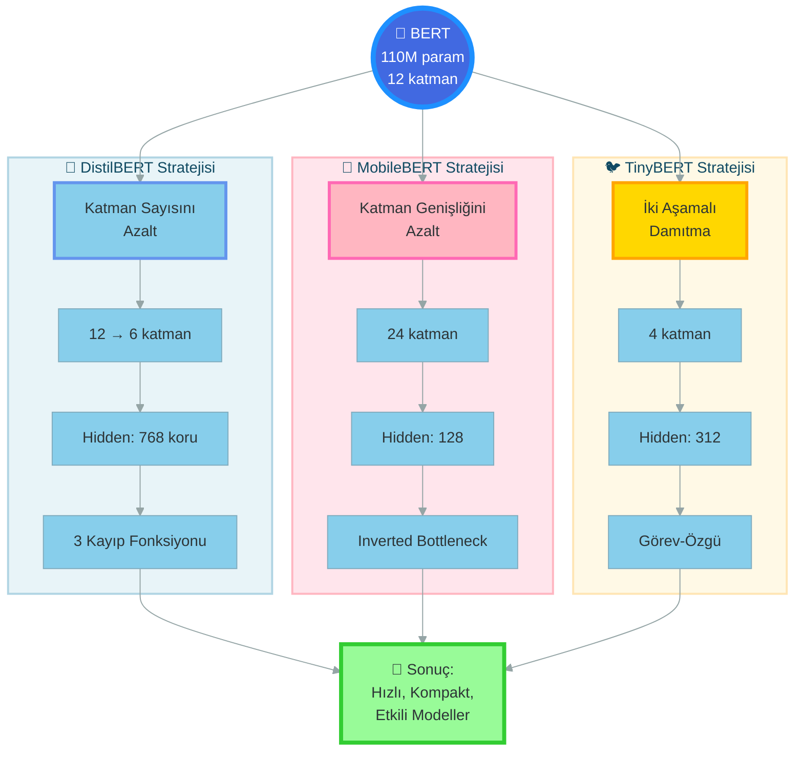
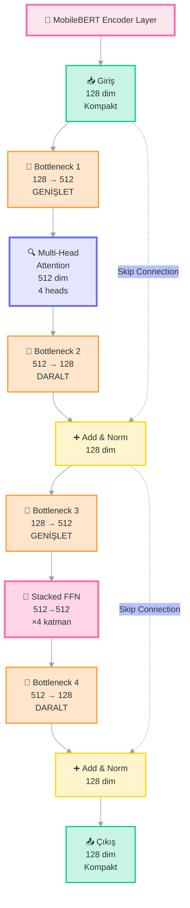
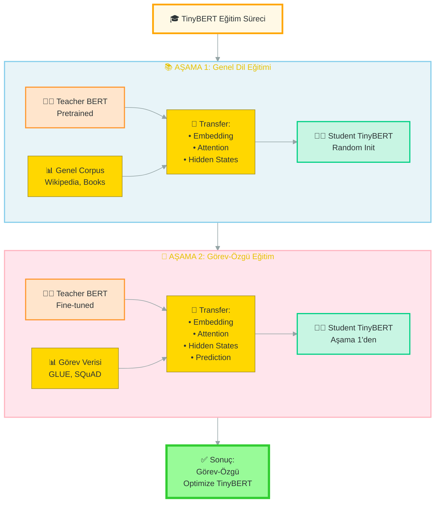
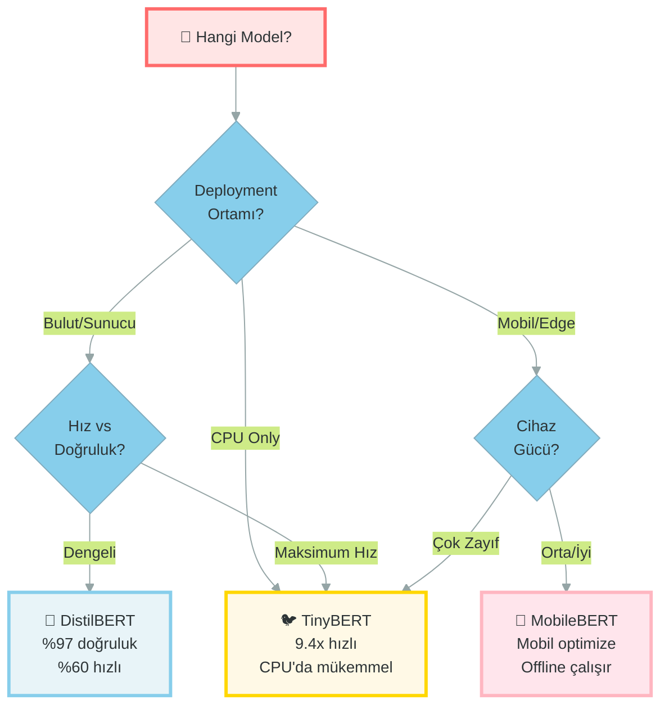

<div align="center">

```text
    ██╗  ██╗███╗   ██╗ ██████╗ ██╗    ██╗██╗     ███████╗██████╗  ██████╗ ███████╗
    ██║ ██╔╝████╗  ██║██╔═══██╗██║    ██║██║     ██╔════╝██╔══██╗██╔════╝ ██╔════╝
    █████╔╝ ██╔██╗ ██║██║   ██║██║ █╗ ██║██║     █████╗  ██║  ██║██║  ███╗█████╗  
    ██╔═██╗ ██║╚██╗██║██║   ██║██║███╗██║██║     ██╔══╝  ██║  ██║██║   ██║██╔══╝  
    ██║  ██╗██║ ╚████║╚██████╔╝╚███╔███╔╝███████╗███████╗██████╔╝╚██████╔╝███████╗
    ╚═╝  ╚═╝╚═╝  ╚═══╝ ╚═════╝  ╚══╝╚══╝ ╚══════╝╚══════╝╚═════╝  ╚═════╝ ╚══════╝
                                                                                    
    ██████╗ ██╗███████╗████████╗██╗██╗     ██╗      █████╗ ████████╗██╗ ██████╗ ███╗   ██╗
    ██╔══██╗██║██╔════╝╚══██╔══╝██║██║     ██║     ██╔══██╗╚══██╔══╝██║██╔═══██╗████╗  ██║
    ██║  ██║██║███████╗   ██║   ██║██║     ██║     ███████║   ██║   ██║██║   ██║██╔██╗ ██║
    ██║  ██║██║╚════██║   ██║   ██║██║     ██║     ██╔══██║   ██║   ██║██║   ██║██║╚██╗██║
    ██████╔╝██║███████║   ██║   ██║███████╗███████╗██║  ██║   ██║   ██║╚██████╔╝██║ ╚████║
    ╚═════╝ ╚═╝╚══════╝   ╚═╝   ╚═╝╚══════╝╚══════╝╚═╝  ╚═╝   ╚═╝   ╚═╝ ╚═════╝ ╚═╝  ╚═══╝
```

### 🧠 BERT Modellerini Damıtma ile Kompakt ve Hızlı Hale Getirme

**DistilBERT | MobileBERT | TinyBERT - Teorik Derinlemesine İnceleme**

---

[](https://python.org)
[](https://huggingface.co/transformers)
[](https://pytorch.org)
[](https://arxiv.org)
[](LICENSE)

</div>

---

## 🌟 Genel Bakış

Bu proje, **BERT modellerinin** üç farklı **Knowledge Distillation (Bilgi Damıtma)** yaklaşımıyla nasıl küçültüldüğünü, hızlandırıldığını ve optimize edildiğini **teorik derinlikle** inceler. YBS (Yönetim Bilişim Sistemleri) perspektifiyle gerçek dünya senaryolarına odaklanır.

### 🎯 Proje Özellikleri

<table>
<tr>
<td width="33%" valign="top">

**📚 DistilBERT**
- ✅ Katman azaltma stratejisi
- ✅ 6 katman (12'den yarıya)
- ✅ 66M parametre
- ✅ %60 daha hızlı
- ✅ %40 daha küçük
- ✅ %97 performans koruması

</td>
<td width="33%" valign="top">

**📱 MobileBERT**
- ✅ Inverted Bottleneck yapısı
- ✅ 24 katman (derinlik korunur)
- ✅ 25M parametre
- ✅ Mobil cihaz optimizasyonu
- ✅ 128 hidden size
- ✅ CPU'da çalışabilir

</td>
<td width="33%" valign="top">

**🐦 TinyBERT**
- ✅ İki aşamalı damıtma
- ✅ 4 katman (en küçük)
- ✅ 14M parametre
- ✅ 9.4x daha hızlı
- ✅ Görev-özgü optimizasyon
- ✅ Ultra kompakt

</td>
</tr>
</table>

### 🎭 3 Farklı Yaklaşım, Tek Hedef: Verimlilik



---

## 📊 Model Performans Karşılaştırması

### 🎯 Teknik Özellikler

<table>
<tr>
<td align="center" width="20%">
<div>
<h3>🔵</h3>
<h2>BERT-Base</h2>
<p><b>Baseline</b></p>
</div>
</td>
<td align="center" width="20%">
<div>
<h3>📘</h3>
<h2>DistilBERT</h2>
<p><b>Katman Azaltma</b></p>
</div>
</td>
<td align="center" width="20%">
<div>
<h3>📱</h3>
<h2>MobileBERT</h2>
<p><b>Genişlik Azaltma</b></p>
</div>
</td>
<td align="center" width="20%">
<div>
<h3>🐦</h3>
<h2>TinyBERT</h2>
<p><b>İki Aşamalı</b></p>
</div>
</td>
</tr>
</table>

| Metrik | BERT-Base | DistilBERT | MobileBERT | TinyBERT |
|--------|-----------|------------|------------|----------|
| **Parametre Sayısı** | 110M | 66M | 25M | 14M |
| **Katman Sayısı** | 12 | 6 | 24 | 4 |
| **Hidden Size** | 768 | 768 | 128 | 312 |
| **Attention Heads** | 12 | 12 | 4 | 12 |
| **Hız (Relative)** | 1.0x | 1.6x | 4.0x | 9.4x |
| **Model Boyutu** | ~440MB | ~260MB | ~100MB | ~60MB |
| **GLUE Score** | 79.6 | 77.0 | 77.7 | 74.5 |
| **SQuAD F1** | 88.5 | 86.9 | 90.0 | 82.1 |
| **Performans Koruması** | 100% | 97% | 96% | 93% |

### ⚙️ Deployment Senaryoları

| Senaryo | BERT-Base | DistilBERT | MobileBERT | TinyBERT |
|---------|-----------|------------|------------|----------|
| **Bulut Sunucu (GPU)** | ✅✅✅ | ✅✅✅ | ✅✅ | ✅ |
| **Edge Computing** | ⚠️ | ✅✅ | ✅✅✅ | ✅✅ |
| **Mobil Cihaz** | ❌ | ⚠️ | ✅✅✅ | ✅✅✅ |
| **IoT Cihazları** | ❌ | ❌ | ⚠️ | ✅ |
| **Offline Kullanım** | ⚠️ | ✅ | ✅✅✅ | ✅✅✅ |
| **Gerçek Zamanlı** | ⚠️ | ✅ | ✅✅ | ✅✅✅ |

---

## 📂 Proje Yapısı

```
05.knowledge-distillation-distilbert_tinybert_mobilebert/
│
├── 📓 01.distilbert.ipynb          # DistilBERT teorik inceleme
├── 📓 02.mobilebert.ipynb          # MobileBERT teorik inceleme
├── 📓 03.tinybert.ipynb            # TinyBERT teorik inceleme
├── 📄 README.md                     # Bu dosya
└── 📄 ornREADME.md                  # Referans örnek dosya
```

---

## 📘 Model 1: DistilBERT - Katman Azaltma Stratejisi

### 🎯 Ana Konsept

**DistilBERT**, BERT-Base'in katman sayısını **yarıya indirerek** (12 → 6) küçültme ve hızlandırma sağlar. **Sığ ama geniş** bir mimari yaklaşımı benimser.


### 📐 Üç Kayıp Fonksiyonu

DistilBERT, öğretmenden bilgi transfer ederken **3 farklı kayıp fonksiyonu** kullanır:

#### 1️⃣ **Distillation Loss (Damıtma Kaybı)**

Öğretmenin soft probability dağılımını taklit eder.

$$
\mathcal{L}_{\text{distil}} = -\sum_{i} p_i^{\text{teacher}} \log(p_i^{\text{student}})
$$

**Temperature Scaling:**

$$
p_i = \frac{\exp(z_i / T)}{\sum_j \exp(z_j / T)}
$$

- **T = 1:** Normal softmax (keskin kararlar)
- **T > 1:** Yumuşak dağılım (sınıflar arası ilişkiler görünür)

#### 2️⃣ **Student Loss (Öğrenci Kaybı)**

Gerçek etiketlerle standard cross-entropy:

$$
\mathcal{L}_{\text{student}} = -\sum_{i} y_i \log(\hat{y}_i)
$$

#### 3️⃣ **Cosine Embedding Loss (Kosinüs Kayıp)**

Hidden state'lerin yönlerini hizalar:

$$
\mathcal{L}_{\text{cosine}} = 1 - \frac{h^{\text{teacher}} \cdot h^{\text{student}}}{\|h^{\text{teacher}}\| \|h^{\text{student}}\|}
$$

**Toplam Kayıp:**

$$
\mathcal{L}_{\text{total}} = \alpha \mathcal{L}_{\text{distil}} + \beta \mathcal{L}_{\text{student}} + \gamma \mathcal{L}_{\text{cosine}}
$$

### 🎯 Avantajlar ve Kullanım Alanları

✅ **Avantajlar:**
- %60 daha hızlı inference
- %40 daha küçük model boyutu
- %97 performans koruması
- Genel amaçlı kullanım
- Kolay fine-tuning

⚠️ **Trade-offs:**
- Daha sığ mimari (6 katman)
- Kompleks anlam çıkarımında BERT'e göre zayıf
- NSP (Next Sentence Prediction) görevi yok

💼 **İdeal Kullanım:**
- API servisleri
- Gerçek zamanlı sınıflandırma
- Bulut tabanlı sistemler
- Orta ölçekli deployment

---

## 📱 Model 2: MobileBERT - Inverted Bottleneck ile Genişlik Optimizasyonu

### 🎯 Ana Konsept

**MobileBERT**, katman sayısını korurken (24 katman) **hidden size'ı drastik olarak azaltarak** (768 → 128) küçültme sağlar. **Derin ama dar** bir mimari yaklaşımı benimser. Mobil cihazlar ve edge computing için optimize edilmiştir.

### 🎭 Inverted Bottleneck: Dar Giriş, Zengin İşlem, Dar Çıkış



### 🔑 Anahtar Özellikler

#### 1️⃣ **Inverted Bottleneck Yapısı**

**Geleneksel vs Inverted:**

```
❌ Geleneksel Bottleneck:
Geniş (768) → DAR (256) → Geniş (768)
└─ Bilgi kaybı oluşur

✅ Inverted Bottleneck:
DAR (128) → Geniş (512) → DAR (128)
└─ Kompakt iletişim + Zengin işlem
```

**Avantajlar:**
- Giriş/Çıkış hafif (128 dim) → Bellek ↓
- İşlem zengin (512 dim) → Temsil gücü ↑
- Skip connection verimli → Gradient akışı iyi

#### 2️⃣ **Stacked Feed-Forward Networks**

Her encoder layer'da **4 adet FFN** sırayla çalışır:

$$
\text{FFN}_{\text{stacked}} = \text{FFN}_4 \circ \text{FFN}_3 \circ \text{FFN}_2 \circ \text{FFN}_1
$$

Bu yapı, az parametre ile yüksek temsil gücü sağlar.

#### 3️⃣ **Teacher Model: IB-BERT**

MobileBERT, **IB-BERT (Inverted-Bottleneck BERT)** adlı özel bir teacher modelinden öğrenir:

- Teacher da inverted bottleneck kullanır
- Student ile aynı mimari, daha geniş
- 4 tür bilgi transferi yapılır

### 📊 Transfer Mekanizmaları

| Transfer Türü | Ne Aktarılır | Amaç |
|---------------|--------------|------|
| **Attention Transfer** | Dikkat matrisleri | Hangi kelimeye odaklanmalı |
| **Feature Map Transfer** | Hidden states | Ara katman temsilleri |
| **Embedding Transfer** | Token embeddings | Kelime vektörleri |
| **Pre-training Transfer** | MLM çıktıları | Genel dil bilgisi |

### 🎯 Avantajlar ve Kullanım Alanları

✅ **Avantajlar:**
- 25M parametre (BERT'in %23'ü)
- 4x daha hızlı
- Mobil cihazlarda çalışabilir
- 24 katman (derinlik korunur)
- CPU'da bile verimli

⚠️ **Trade-offs:**
- Dar hidden size (128)
- Karmaşık transfer süreci
- Özel teacher modeli gerekir

💼 **İdeal Kullanım:**
- Mobil uygulamalar
- Edge computing
- IoT cihazları
- Offline sistemler
- Gerçek zamanlı inference

---

## 🐦 Model 3: TinyBERT - İki Aşamalı Damıtma Stratejisi

### 🎯 Ana Konsept

**TinyBERT**, bilgi damıtmasını **iki ayrı aşamada** gerçekleştiren benzersiz bir yaklaşımdır. İlk aşamada genel dil bilgisi, ikinci aşamada ise göreve özel bilgi aktarılır.

### 🎭 İki Aşamalı Öğrenme: Genel Eğitim + Görev Eğitimi



### 🔑 4 Seviyeli Bilgi Transferi

TinyBERT, modelin her seviyesinden bilgi transfer eder:

#### 1️⃣ **Embedding Layer Transfer**

Token, positional ve segment embedding'leri aktarır:

$$
\mathcal{L}_{\text{embd}} = \text{MSE}(W_e \cdot E^S, E^T)
$$

- $E^S$: Student embeddings
- $E^T$: Teacher embeddings
- $W_e$: Boyut eşleştirme matrisi

#### 2️⃣ **Hidden States Transfer**

Her katmanın çıktı tensörlerini hizalar:

$$
\mathcal{L}_{\text{hidn}} = \text{MSE}(W_h \cdot H^S, H^T)
$$

#### 3️⃣ **Attention Transfer**

Multi-head attention matrislerini kopyalar:

$$
\mathcal{L}_{\text{attn}} = \frac{1}{h} \sum_{i=1}^{h} \text{MSE}(A_i^S, A_i^T)
$$

- $h$: Attention head sayısı
- $A_i$: i'nci head'in attention matrisi

#### 4️⃣ **Prediction Layer Transfer**

Final softmax çıktılarını yumuşatır:

$$
\mathcal{L}_{\text{pred}} = -\sum_{i} \text{softmax}(z_i^T / t) \cdot \log \text{softmax}(z_i^S / t)
$$

**Toplam Kayıp:**

$$
\mathcal{L}_{\text{total}} = \mathcal{L}_{\text{embd}} + \mathcal{L}_{\text{hidn}} + \mathcal{L}_{\text{attn}} + \mathcal{L}_{\text{pred}}
$$

### 🎯 Avantajlar ve Kullanım Alanları

✅ **Avantajlar:**
- En küçük model (14M parametre)
- 9.4x daha hızlı
- CPU'da mükemmel performans
- Göreve özel optimizasyon
- İki aşamalı öğrenme ile yüksek kalite

⚠️ **Trade-offs:**
- Sadece 4 katman (en sığ)
- Karmaşık eğitim süreci
- Her görev için ayrı model
- Eğitim maliyeti yüksek

💼 **İdeal Kullanım:**
- Toplu işlem sistemleri
- Çağrı merkezi analitiği
- Sosyal medya izleme
- CPU tabanlı deployment
- Yüksek throughput gereken sistemler

---

## 💼 YBS İş Senaryoları: Gerçek Dünya Uygulamaları

### 🎭 Model Seçim Karar Matrisi



### 🏦 Senaryo 1: Banka Müşteri Destek Sistemi

**Durum:** Günde 50,000 müşteri mesajı gelir, otomatik kategorize edilmeli.

| Gereksinim | DistilBERT | MobileBERT | TinyBERT |
|------------|------------|------------|----------|
| **Doğruluk (%95+)** | ✅✅ %97 | ✅ %96 | ⚠️ %93 |
| **Gecikme (<100ms)** | ✅ 55ms | ✅✅ 45ms | ✅✅ 16ms |
| **Maliyet** | Orta | Düşük | Çok Düşük |
| **Sonuç** | ✅ İdeal | ✅ İyi | ⚠️ Doğruluk sınırda |

**Karar:** **DistilBERT** - Doğruluk kritik, performans yeterli.

### 📱 Senaryo 2: Mobil Bankacılık Uygulaması

**Durum:** Kullanıcı mesaj yazıyor, app offline çalışabilmeli.

| Gereksinim | DistilBERT | MobileBERT | TinyBERT |
|------------|------------|------------|----------|
| **Model Boyutu (<100MB)** | ⚠️ 260MB | ✅✅ 100MB | ✅✅ 60MB |
| **Batarya Dostu** | ⚠️ Orta | ✅✅ İyi | ✅✅ Mükemmel |
| **Offline Çalışma** | ✅ Olur | ✅✅ Optimize | ✅✅ Optimize |
| **Sonuç** | ❌ Büyük | ✅✅ Mükemmel | ✅ İyi |

**Karar:** **MobileBERT** - Mobil için özel tasarlandı, boyut ideal.

### 🏢 Senaryo 3: E-Ticaret Toplu Yorum Analizi

**Durum:** Gece 200,000 yorumu toplu işle, CPU üzerinde.

| Gereksinim | DistilBERT | MobileBERT | TinyBERT |
|------------|------------|------------|----------|
| **CPU Performansı** | ⚠️ Yavaş | ✅ İyi | ✅✅ Mükemmel |
| **Throughput** | Orta | Yüksek | Çok Yüksek |
| **Maliyet (CPU)** | Yüksek | Orta | Düşük |
| **Sonuç** | ❌ Maliyetli | ✅ İyi | ✅✅ İdeal |

**Karar:** **TinyBERT** - CPU'da 9.4x hızlı, maliyet minimuma iner.

### 📊 ROI Analizi: Yıllık Maliyet Karşılaştırması

**Senaryo:** Günlük 100K istek, 7/24 çalışan sistem

```
┌──────────────────┬──────────────┬──────────────┬──────────────┬──────────────┐
│                  │  BERT-Base   │  DistilBERT  │  MobileBERT  │  TinyBERT    │
├──────────────────┼──────────────┼──────────────┼──────────────┼──────────────┤
│ Sunucu Tipi      │  GPU (T4)    │  GPU (T4)    │  CPU         │  CPU         │
│ Aylık Maliyet    │  $1,200      │  $500        │  $250        │  $150        │
│ Yıllık           │  $14,400     │  $6,000      │  $3,000      │  $1,800      │
├──────────────────┼──────────────┼──────────────┼──────────────┼──────────────┤
│ Tasarruf         │  Baseline    │  $8,400      │  $11,400     │  $12,600     │
│ (BERT'e göre)    │              │  (58%)       │  (79%)       │  (88%)       │
└──────────────────┴──────────────┴──────────────┴──────────────┴──────────────┘
```

---

## 🚀 Kurulum ve Kullanım

### 📦 Gereksinimler

```bash
Python 3.8+
transformers>=4.30.0
torch>=2.0.0
numpy>=1.24.0
```

### 💻 Hızlı Başlangıç

#### DistilBERT Kullanımı

```python
from transformers import AutoTokenizer, AutoModelForSequenceClassification

# Model ve tokenizer yükleme
model_name = "distilbert-base-uncased"
tokenizer = AutoTokenizer.from_pretrained(model_name)
model = AutoModelForSequenceClassification.from_pretrained(model_name)

# Tahmin
text = "Bu ürün harika!"
inputs = tokenizer(text, return_tensors="pt")
outputs = model(**inputs)
```

#### MobileBERT Kullanımı

```python
from transformers import MobileBertTokenizer, MobileBertForSequenceClassification

# Model yükleme
tokenizer = MobileBertTokenizer.from_pretrained("google/mobilebert-uncased")
model = MobileBertForSequenceClassification.from_pretrained("google/mobilebert-uncased")

# Inference
text = "Hızlı ve verimli!"
inputs = tokenizer(text, return_tensors="pt")
outputs = model(**inputs)
```

#### TinyBERT Kullanımı

```python
from transformers import AutoTokenizer, AutoModelForSequenceClassification

# Model yükleme
tokenizer = AutoTokenizer.from_pretrained("huawei-noah/TinyBERT_General_4L_312D")
model = AutoModelForSequenceClassification.from_pretrained("huawei-noah/TinyBERT_General_4L_312D")

# CPU'da çalıştırma
model.eval()
with torch.no_grad():
    inputs = tokenizer(text, return_tensors="pt")
    outputs = model(**inputs)
```

---

## 📚 Öğrenme Kaynakları

### 📄 Orijinal Makaleler

1. **DistilBERT** (2019)
   - *DistilBERT, a distilled version of BERT: smaller, faster, cheaper and lighter*
   - Victor Sanh et al., Hugging Face
   - [arXiv:1910.01108](https://arxiv.org/abs/1910.01108)

2. **MobileBERT** (2020)
   - *MobileBERT: a Compact Task-Agnostic BERT for Resource-Limited Devices*
   - Zhiqing Sun et al., CMU & Google
   - [arXiv:2004.02984](https://arxiv.org/abs/2004.02984)

3. **TinyBERT** (2020)
   - *TinyBERT: Distilling BERT for Natural Language Understanding*
   - Xiaoqi Jiao et al., Huawei Noah's Ark Lab
   - [arXiv:1909.10351](https://arxiv.org/abs/1909.10351)

### 🔗 Faydalı Linkler

- [Hugging Face Model Hub](https://huggingface.co/models)
- [BERT Paper](https://arxiv.org/abs/1810.04805)
- [Knowledge Distillation Survey](https://arxiv.org/abs/2006.05525)
- [Transformers Documentation](https://huggingface.co/docs/transformers)

---

## 🎓 Öğrenme Hedefleri

Bu projeyi tamamladığınızda:

✅ **Knowledge Distillation** kavramını derinlemesine anlayacaksınız  
✅ **Teacher-Student** paradigmasının matematiksel temellerini kavrayacaksınız  
✅ **3 farklı damıtma stratejisini** karşılaştırabileceksiniz  
✅ **Model seçimi** için YBS perspektifiyle karar verebileceksiniz  
✅ **Performans-Maliyet** dengesini analiz edebileceksiniz  
✅ **Deployment senaryolarına** göre doğru modeli seçebileceksiniz  
✅ **İş dünyası uygulamalarında** pratik çözümler üretebileceksiniz  

---

## 🤝 Katkıda Bulunma

Bu proje eğitim amaçlıdır. Önerileriniz için issue açabilir veya pull request gönderebilirsiniz.

---

## 📜 Lisans

Bu proje eğitim amaçlı hazırlanmıştır. Kaynak göstererek kullanabilirsiniz.

---

<div align="center">

### 🌟 Başarılar Dileriz! 🌟

**"En iyi model, en doğru olanı değil; işletme hedeflerine en uygun olanıdır."**

---

Made with ❤️ by Cemal YÜKSEL for YBS Students

</div>

